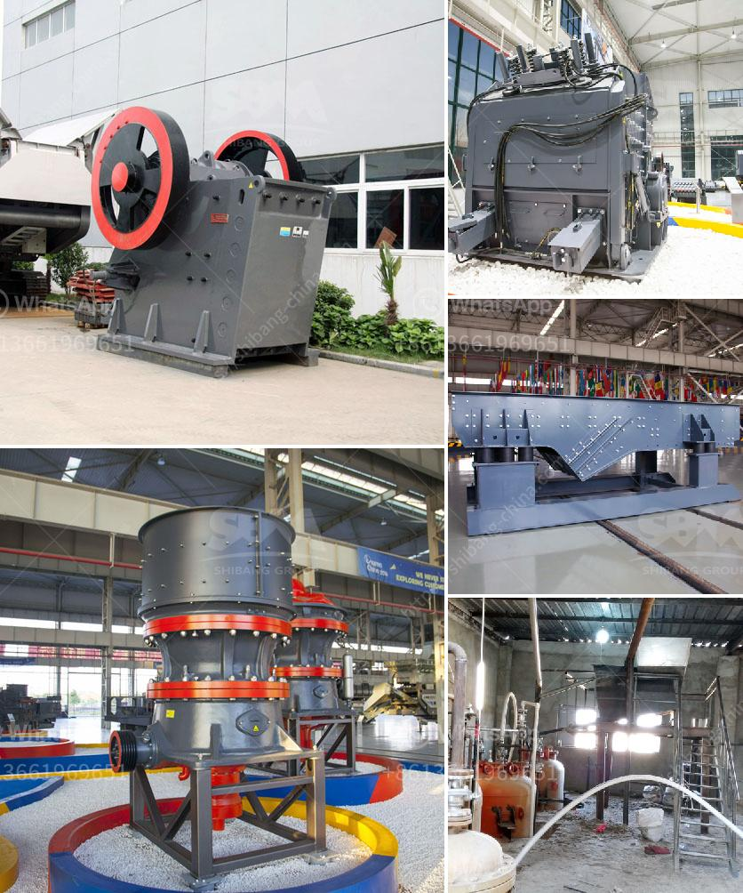

<h3>quartz cobble making machines in india</h3>
Quartz is a widely abundant mineral found in the Earth's crust. It is known for its durability and aesthetic appeal, making it a popular choice for various construction purposes. In recent years, the demand for quartz cobbles has been on the rise in India, leading to the development of quartz cobble making machines.

India, known for its rich reserves of natural stones, has witnessed an increased demand for quartz cobbles due to their versatility and elegance. Quartz cobbles are extensively used for paving walkways, driveways, and outdoor spaces, as well as for landscaping purposes. The machine-assisted production of these cobbles has proved to be a boon for the construction industry.

The quartz cobble making machines in India are designed to efficiently manufacture high-quality cobbles at a faster pace. These machines are equipped with state-of-the-art technology and automated processes that ensure precision and consistency in output. Moreover, the machines are user-friendly, allowing operators to control various parameters and customize the cobble's shape, size, and finish.

One of the key advantages of using quartz cobble making machines is the cost-effectiveness they offer. These machines streamline the production process, reducing labor costs and material wastage. With manual production, it is challenging to achieve uniformity in size and shape, leading to higher rejection rates. However, the use of machines ensures that each cobble produced meets the desired specifications, resulting in minimal rejection.

Additionally, the use of quartz cobble making machines enhances production capacity. With manual production, the output is limited by the number of workers and their skill level. The machines, on the other hand, have the capability to produce a significantly larger quantity of cobbles in a shorter duration. This has a positive impact on project timelines, allowing for faster completion and subsequent cost savings.

The advent of quartz cobble making machines in India has also contributed to the conservation of natural resources. These machines minimize the need for extensive mining operations, as they utilize quartz waste from existing mining sites. By repurposing this waste material, the machines not only reduce the environmental impact but also contribute to a circular economy.

Furthermore, the use of quartz cobble making machines has improved the quality and consistency of the cobbles produced. Manual production often results in variations in color, finish, and strength, which can affect the overall aesthetic appeal and durability of the project. The automated processes of these machines ensure that each cobble is manufactured to a high standard, meeting the expectations of clients and architects.

In conclusion, quartz cobble making machines have brought about significant advancements in the production of cobbles in India. These machines offer numerous benefits, including cost-effectiveness, increased production capacity, resource conservation, and improved quality. With the demand for quartz cobbles on the rise, these machines have become an indispensable tool for the construction industry, providing elegant and durable solutions for various projects.
<h3>Contact us</h3><ul><li><strong>Whatsapp:&nbsp;<a href="https://wa.me/8613661969651">+8613661969651</a></strong></li><li><a href="https://swt.shibang-china.com/?git&amp;zhl&amp;quartz cobble making machines in india"><strong>Online Service(chat now)</strong></a></li></ul><h3>Related</h3><ul><li><a href='charcoal coal making process.md'>charcoal coal making process</a></li><li><a href='portable sand washing machine.md'>portable sand washing machine</a></li><li><a href='concrete stone crusher uk for sale.md'>concrete stone crusher uk for sale</a></li><li><a href='stone crusher contact.md'>stone crusher contact</a></li><li><a href='conveyor chain suppliers south africa.md'>conveyor chain suppliers south africa</a></li></ul>