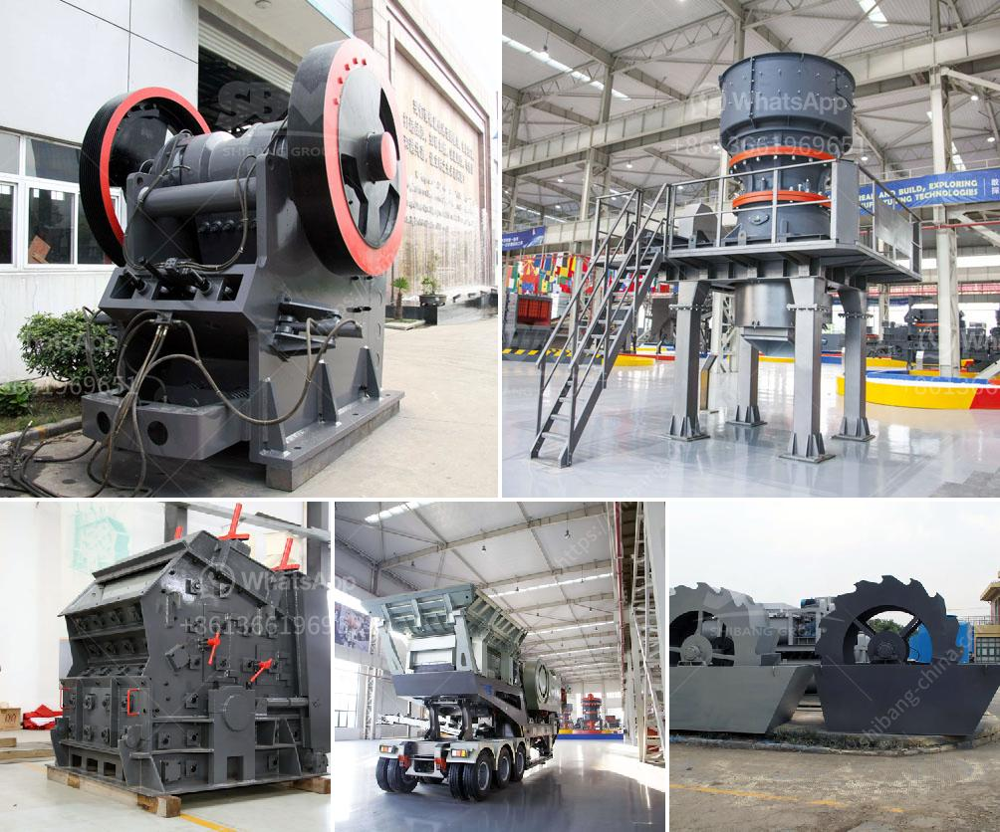

<h3>quartz crusher plant cost</h3>
Quartz is one of the most abundant minerals on Earth. It has a wide range of applications, from jewelry to electronics, and it is also used extensively in the construction industry. To meet the growing demand for quartz, various industries are investing in quartz crusher plants.

A quartz crusher plant is a machine that is used in crushing of hard quartz pieces into fine particles. The machine is built in such a way that it can crush quartz pieces of different sizes, ranging from 4cm to 2cm.

The quartz crusher plant is manufactured with precision and high-quality components to ensure durability and efficiency. The quartz crusher plant comes with a vibrating feeder, jaw crusher, impact crusher, vibrating screen, belt conveyor, and centralized electric control system. These machines are of excellent quality and offer reliable performance.

When it comes to the cost of setting up a quartz crusher plant, it is crucial to consider various factors. The size, capacity, and efficiency of the plant are some of the primary factors that influence the cost. Additionally, the location of the plant and the availability of quartz are also important factors to consider.

A quartz crusher plant with a capacity of 100-300 TPH can cost around $50,000 to $1 million. The exact cost depends on the size, capacity, and location of the plant. To reduce the cost of investment, one can choose a smaller capacity plant or opt for a mobile crusher plant. Mobile crusher plants are more cost-effective, as they eliminate the need for transportation and installation.

In conclusion, investing in a quartz crusher plant can be a profitable venture due to the increasing demand for quartz in various industries. However, it is essential to carefully assess the cost and choose a plant that meets the requirements and budget. With proper planning and research, one can set up a successful quartz crusher plant and tap into the lucrative quartz market.
<h3>Contact us</h3><ul><li><strong>Whatsapp:&nbsp;<a href="https://wa.me/8613661969651">+8613661969651</a></strong></li><li><a href="https://swt.shibang-china.com/?git&amp;zhl&amp;quartz crusher plant cost"><strong>Online Service(chat now)</strong></a></li></ul><h3>Related</h3><ul><li><a href='small impact crusher 100 mesh.md'>small impact crusher 100 mesh</a></li><li><a href='how to design stone crusher building.md'>how to design stone crusher building</a></li><li><a href='vibrating screen size 1mm.md'>vibrating screen size 1mm</a></li><li><a href='silica sand refind machines in germany.md'>silica sand refind machines in germany</a></li><li><a href='calcium plant in india.md'>calcium plant in india</a></li></ul>