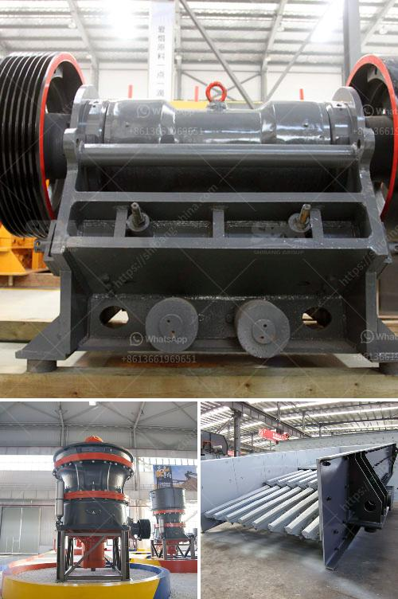

<h3>quartz crusher prices</h3>
Quartz is a kind of mineral that is widely used in building materials and industrial applications. It is a hard, wear-resistant, and chemically stable silicate mineral. The main component of quartz is silicon dioxide, which is an important raw material for the manufacture of glass, ceramics, and other products. Due to its high hardness and durability, it is also commonly used as an aggregate in construction projects.

One of the key machines used in the crushing process of quartz is the quartz crusher. It is an essential equipment that grinds quartz into crushed stone or powder for further processing and applications. With the increasing demand for quartz materials in various industries, the market for quartz crushers has also seen significant growth.

When it comes to the price of quartz crushers, there are several factors that can influence it. Firstly, the type and model of the crusher can affect its price. There are different types of quartz crushers available, such as jaw crushers, impact crushers, and cone crushers. Each type has its own features and advantages, and the price may vary accordingly. Additionally, the production capacity and finished product size requirement can also impact the price. Crushers with higher capacity and smaller output size tend to be more expensive.

Furthermore, the brand and reputation of the crusher manufacturer can also affect its price. Well-known brands usually have higher prices due to their reliable quality and after-sales service. However, it is worth noting that some lesser-known brands may offer competitive prices without compromising on quality.

In conclusion, the price of quartz crushers can vary depending on factors such as the type of crusher, production capacity, finished product size requirement, and brand reputation. It is important for buyers to consider their specific needs and budget when choosing a quartz crusher. Conducting thorough research, comparing prices, and seeking advice from industry experts can help buyers make informed decisions and find the best crushers at the most reasonable prices.
<h3>Contact us</h3><ul><li><strong>Whatsapp:&nbsp;<a href="https://wa.me/8613661969651">+8613661969651</a></strong></li><li><a href="https://swt.shibang-china.com/?git&amp;zhl&amp;quartz crusher prices"><strong>Online Service(chat now)</strong></a></li></ul><h3>Related</h3><ul><li><a href='silica sand plant supplier in malaysia.md'>silica sand plant supplier in malaysia</a></li><li><a href='screening coal crushing plant.md'>screening coal crushing plant</a></li><li><a href='impact crusher suppliers italy.md'>impact crusher suppliers italy</a></li><li><a href='roller conveyor belts.md'>roller conveyor belts</a></li><li><a href='running sponge iron plant for sale in gujarat.md'>running sponge iron plant for sale in gujarat</a></li></ul>