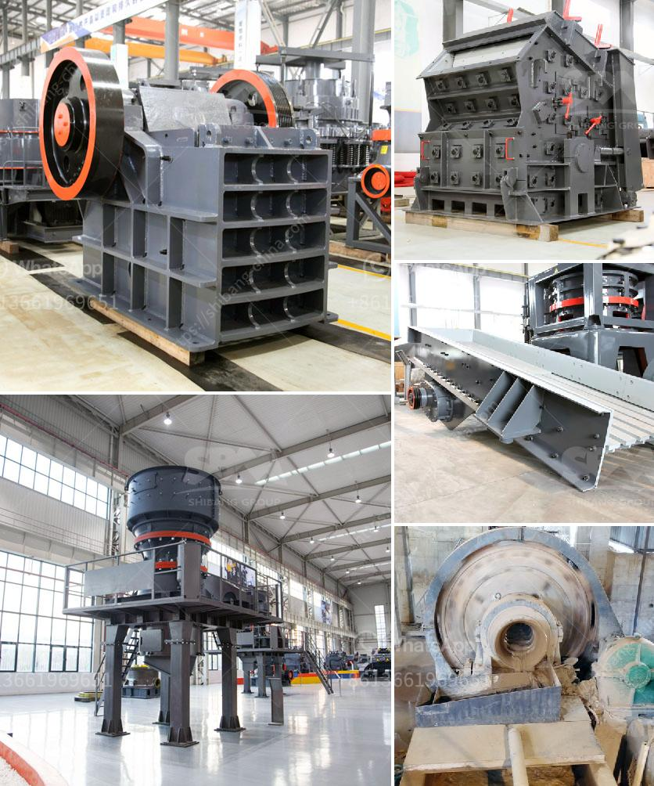

<h3>quartz crushers price in india</h3>
Quartz, also known as silica, is one of the most abundant minerals on Earth. It is primarily used in the manufacturing of glass, ceramics, and electronics. To obtain finely crushed quartz, the quartz crusher is a necessary step in the process.

Quartz crushers are used to crush large quartz stones into smaller particles. Depending on the final desired size, quartz crushers are categorized into various types. The most common types are jaw crusher, cone crusher, and impact crusher. Jaw crusher, which is used for crushing large-sized quartz stones, is ideal for primary crushing. The cone crusher is used for secondary crushing and the impact crusher is used for fine crushing.

The price range is wide due to different technical features. The more advanced the technical content is, the higher the price will be. Most quartz crusher manufacturers have different prices, so it is necessary to do market research in advance. While focusing on price, quality should also be considered. Crushing quartz is an investment, so it is essential to check the quality of the equipment to ensure its long-term efficiency and productivity.

In India, the price of quartz crushers varies widely. Depending on the type, size, and technical features, the price may range from a few thousand to hundreds of thousands of rupees. When choosing a crusher, it is important to check whether the manufacturer offers after-sales service. A reliable after-sales service can guarantee the smooth operation of the equipment and minimize the downtime.

In conclusion, quartz crushers are essential equipment for quartz crushing. The price of quartz crushers in India depends on various factors, such as the type, size, and technical features. It is important to choose a crusher with good quality and after-sales service to ensure efficient and productive crushing operations.
<h3>Contact us</h3><ul><li><strong>Whatsapp:&nbsp;<a href="https://wa.me/8613661969651">+8613661969651</a></strong></li><li><a href="https://swt.shibang-china.com/?git&amp;zhl&amp;quartz crushers price in india"><strong>Online Service(chat now)</strong></a></li></ul><h3>Related</h3><ul><li><a href='mobile crushing and screening manufacturer in india.md'>mobile crushing and screening manufacturer in india</a></li><li><a href='mining tenders in south africa.md'>mining tenders in south africa</a></li><li><a href='mining industry in mpumalanga.md'>mining industry in mpumalanga</a></li><li><a href='stone crushing importer companies in south africa.md'>stone crushing importer companies in south africa</a></li><li><a href='used stone crusher plant for sale in china.md'>used stone crusher plant for sale in china</a></li></ul>