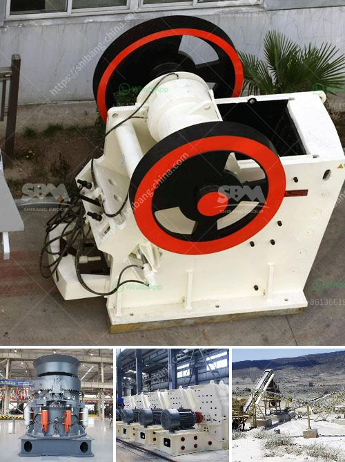

<h3>quartz crushing process</h3>
Quartz is a mineral that is found abundantly in the Earth's crust. It is a common component in igneous, metamorphic, and sedimentary rocks. Quartz is also used in various industries such as glass, ceramics, and electronics due to its properties like high resistance to heat and chemical inertness.

To extract quartz from its ore, the quartz crushing process needs to be followed. Different quartz crushing stages are necessary in order to obtain the desired size of quartz grains. Crushing is done by a vibrating machine that crushes quartz rocks into smaller pieces. The vibrating machine then screens the crushed material to separate it into different sizes.

The first stage of the quartz crushing process is the rough crushing. In this stage, the quartz rock is crushed by a jaw crusher, which produces rough crushed quartz particles with a size of about 150mm. The crushed quartz is then transported by a belt conveyor and stored as a pile. Next, the quartz is fed into a vibrating screen, which separates it into different sizes.

The second stage of the quartz crushing process is the fine crushing. In this stage, the quartz particles are crushed by a cone crusher, which produces fine crushed quartz particles with a size of about 6mm. The fine crushed quartz is then transported by a belt conveyor and stored as a pile. After that, the quartz is again fed into a vibrating screen, which separates it into different sizes.

The final stage of the quartz crushing process is the screening stage. In this stage, the quartz particles are screened by a vibrating screen, and the desired sizes are obtained. The screened quartz is then transported by a belt conveyor and stored as a pile. The sizes of the quartz grains can vary depending on the requirements of different industries. For example, larger quartz particles may be used in the production of glass, while smaller particles are used in electronics.

In conclusion, the quartz crushing process is essential in obtaining the desired size of quartz grains for various industries. The process involves rough crushing, fine crushing, and screening of the quartz ore. These stages help to extract the quartz and separate it into different sizes. The final quartz grains are then used in industries such as glass, ceramics, and electronics. With the advancements in technology, the quartz crushing process has become more efficient and productive, allowing for the extraction of high-quality quartz for different applications.
<h3>Contact us</h3><ul><li><strong>Whatsapp:&nbsp;<a href="https://wa.me/8613661969651">+8613661969651</a></strong></li><li><a href="https://swt.shibang-china.com/?git&amp;zhl&amp;quartz crushing process"><strong>Online Service(chat now)</strong></a></li></ul><h3>Related</h3><ul><li><a href='ball mill manufacturer india.md'>ball mill manufacturer india</a></li><li><a href='stone crushing machinery suppliers.md'>stone crushing machinery suppliers</a></li><li><a href='china raymond mill company.md'>china raymond mill company</a></li><li><a href='single stage crusher price list in south africa.md'>single stage crusher price list in south africa</a></li><li><a href='philippine gold processing refining.md'>philippine gold processing refining</a></li></ul>