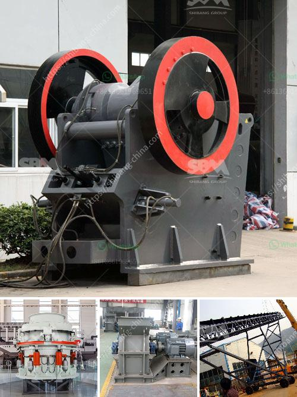

<h3>quartz grinding plants in philippines</h3>
The Philippines has been deemed as one of the fastest-growing economies in Southeast Asia, primarily driven by its robust manufacturing sector. A key component of this sector is the quartz industry, which contributes significantly to the country's industrial growth. Quartz grinding plants, which are essential for the processing of quartz, have emerged as vital players in this industry, facilitating the production of high-quality quartz products for various applications.

Quartz, a mineral composed of silicon dioxide, boasts an extensive range of applications due to its unique properties. It is widely used in industries such as electronics, ceramics, construction, and chemical manufacturing. However, the raw quartz needs to be processed through grinding plants to obtain high-quality quartz powder or granules required for these applications. Hence, the establishment of efficient quartz grinding plants in the Philippines has become imperative.

The grinding process involves crushing the quartz into smaller fragments and then grinding them into fine powder or granules. This transformation enhances the properties of the quartz, such as its purity, color, and particle size distribution. To achieve optimal results, advanced grinding techniques and state-of-the-art machinery are employed in these plants.

One prominent player in the quartz grinding industry in the Philippines is XSM. With over two decades of experience, XSM has developed a strong reputation for its high-quality quartz products and technological prowess. XSM's quartz grinding plants are equipped with advanced machinery that enables precise control over the grinding process, ensuring consistent and superior-grade quartz products.

The establishment of efficient quartz grinding plants in the Philippines has had a positive impact on the country's industrial growth. Firstly, it has enhanced the availability of high-quality quartz products, catering to the increasing demands of various industries. The superior-grade quartz powder and granules obtained from these grinding plants have enabled the manufacturing of high-performance electronic components, such as silicon wafers for semiconductors.

Secondly, the presence of these grinding plants has fostered the growth of downstream industries that rely on quartz as a raw material. For instance, the ceramic tiles industry has witnessed significant expansion due to the availability of high-quality quartz granules. Likewise, the chemical manufacturing sector has experienced a boost, as quartz powder is used in the production of glass, paint, and coatings.

Moreover, the establishment of quartz grinding plants in the Philippines has also contributed to job creation and economic development. These plants require a skilled workforce for operation and maintenance, providing employment opportunities to local communities. Additionally, the increased demand for quartz products has led to the growth of raw material suppliers and transportation services, generating further economic benefits.

In conclusion, quartz grinding plants have become indispensable in the Philippines' industrial landscape, bolstering the nation's economic growth and development. These plants ensure the availability of high-quality quartz products that cater to various industries, including electronics, ceramics, construction, and chemical manufacturing. Furthermore, the presence of these grinding plants fosters the growth of downstream industries and generates employment opportunities, contributing to the overall prosperity of the country. With ongoing advancements in technology and increasing demand for quartz products, the future of quartz grinding plants in the Philippines looks promising.
<h3>Contact us</h3><ul><li><strong>Whatsapp:&nbsp;<a href="https://wa.me/8613661969651">+8613661969651</a></strong></li><li><a href="https://swt.shibang-china.com/?git&amp;zhl&amp;quartz grinding plants in philippines"><strong>Online Service(chat now)</strong></a></li></ul><h3>Related</h3><ul><li><a href='gold mining production line or gold mining plant.md'>gold mining production line or gold mining plant</a></li><li><a href='equipment for crushing gravel.md'>equipment for crushing gravel</a></li><li><a href='small stone crusher plant in india.md'>small stone crusher plant in india</a></li><li><a href='micro powder mill cost.md'>micro powder mill cost</a></li><li><a href='mica powder manufacturing process.md'>mica powder manufacturing process</a></li></ul>