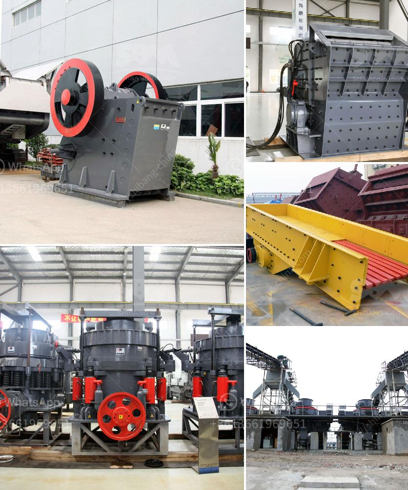

<h3>quartz grinding pulveriser single phase</h3>
Quartz grinding pulverizer single phase is a high-speed size reduction machine that crushes and grinds quartz stone into fine powder. It is suitable for a wide range of applications such as glass manufacturing, ceramics, and foundries. This pulverizer offers efficiency, reliability, and performance in grinding quartz.

The quartz grinding pulverizer has a single-phase motor that operates on a 220V power supply. With its high-speed rotation, it delivers a powerful crushing force to grind quartz into fine particles. The machine is designed with a heavy-duty steel frame and robust components to withstand the demanding grinding process.

One of the key advantages of using a quartz grinding pulverizer is its ability to produce a uniform and consistent product. The pulverizer ensures that the quartz particles are ground to the desired particle size, which is essential for various applications. Whether it is for glass, ceramics, or foundry industries, the finely ground quartz powder has a consistent size distribution, ensuring high-quality end products.

In addition to its uniform grinding capability, the single-phase quartz grinding pulverizer also offers high throughput. With its powerful motor and efficient grinding mechanism, it can process a large amount of quartz in a short period of time. This enables manufacturers to increase their production capacity and meet the growing demand for quartz-based products.

Moreover, the quartz grinding pulverizer is user-friendly and easy to operate. The machine is equipped with a digital control panel that allows operators to adjust the grinding speed, time, and other parameters as per their requirements. The intuitive interface ensures that even inexperienced operators can use the machine effectively and achieve the desired grinding results.

Another advantage of using a single-phase quartz grinding pulverizer is its compact size and portability. The machine has a small footprint, making it ideal for small-scale manufacturing facilities or research laboratories. Its lightweight design allows for easy transportation and installation, ensuring that it can be used in various settings.

Furthermore, the quartz grinding pulverizer is built to last. Made from durable materials and precision-engineered components, it can withstand the rigors of continuous operation. The machine requires minimal maintenance, and its robust construction ensures a long service life, reducing downtime and increasing productivity.

Overall, the quartz grinding pulverizer single phase is a reliable and efficient machine for grinding quartz into fine powder. Its uniform grinding capability, high throughput, user-friendly operation, and compact design make it an ideal choice for manufacturers in various industries. It offers the ability to produce high-quality quartz powder consistently, contributing to the production of superior products. With its durability and low maintenance requirements, the quartz grinding pulverizer is a cost-effective solution for grinding quartz efficiently.
<h3>Contact us</h3><ul><li><strong>Whatsapp:&nbsp;<a href="https://wa.me/8613661969651">+8613661969651</a></strong></li><li><a href="https://swt.shibang-china.com/?git&amp;zhl&amp;quartz grinding pulveriser single phase"><strong>Online Service(chat now)</strong></a></li></ul><h3>Related</h3><ul><li><a href='specification jaw crusher.md'>specification jaw crusher</a></li><li><a href='stone equipment hammer mill philippines.md'>stone equipment hammer mill philippines</a></li><li><a href='cone crusher south africa.md'>cone crusher south africa</a></li><li><a href='stone crusher aggregate supplier kota.md'>stone crusher aggregate supplier kota</a></li><li><a href='iron ore concentrate machinery.md'>iron ore concentrate machinery</a></li></ul>