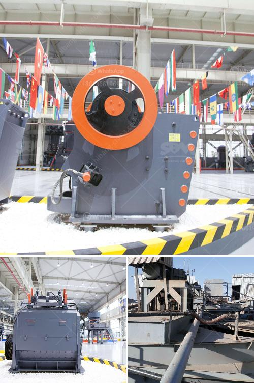

<h3>quartz making machine</h3>
In today's fast-paced and technologically advanced world, the manufacturing industry is constantly seeking innovation and efficiency to meet rising demands. One such revolutionary machine that has transformed the quartz manufacturing process is the quartz making machine. With its ability to automate and streamline production, this machine has rapidly gained popularity and become an invaluable asset for manufacturers.

The quartz making machine is designed with precision engineering to handle the complex process of transforming raw quartz into brilliantly finished products. It incorporates advanced technology and state-of-the-art machinery to ensure high-quality output while minimizing downtime and errors. This groundbreaking machine has the capacity to create a wide range of products, including kitchen countertops, bathroom vanity tops, flooring tiles, and even intricate designs for decorative purposes.

One of the key features of the quartz making machine is its ability to cut, shape, and polish quartz slabs with utmost accuracy. This not only saves time but also reduces wastage, making it an environmentally friendly option. Additionally, the machine is equipped with automated controls and sensors, which ensure consistent and uniform product quality. Moreover, manufacturers can easily customize and program the machine to produce various sizes, shapes, and finishes, catering to different customer preferences.

Another significant advantage of the quartz making machine is its ability to enhance productivity and overall output. By eliminating manual labor and tedious processes, it drastically reduces the time required to manufacture quartz products. This increased efficiency allows manufacturers to meet large-scale orders and tight deadlines effortlessly, thereby boosting their competitiveness in the market.

Furthermore, investing in a quartz making machine proves to be a financially viable decision for manufacturers. Despite the upfront cost, the long-term benefits obtained from increased productivity, reduced wastage, and improved product quality outweigh the initial investment. Moreover, the machine's durability and low maintenance requirements contribute to its cost-effectiveness and longevity.

In conclusion, the quartz making machine has revolutionized the manufacturing industry, particularly in the production of quartz-based products. With its ability to automate processes, enhance productivity, and ensure consistent product quality, this machine has become an indispensable tool for manufacturers. Its efficiency, precision, and cost-effectiveness set the stage for the industry's future evolution and undoubtfully establish it as an industry leader.
<h3>Contact us</h3><ul><li><strong>Whatsapp:&nbsp;<a href="https://wa.me/8613661969651">+8613661969651</a></strong></li><li><a href="https://swt.shibang-china.com/?git&amp;zhl&amp;quartz making machine"><strong>Online Service(chat now)</strong></a></li></ul><h3>Related</h3><ul><li><a href='processing of platinum ore flow sheet.md'>processing of platinum ore flow sheet</a></li><li><a href='mining tenders in south africa.md'>mining tenders in south africa</a></li><li><a href='mining equipment agent in iran.md'>mining equipment agent in iran</a></li><li><a href='mineral pulverising ball mill manufacturer in india.md'>mineral pulverising ball mill manufacturer in india</a></li><li><a href='from lead ore saparated gold and silver plant.md'>from lead ore saparated gold and silver plant</a></li></ul>