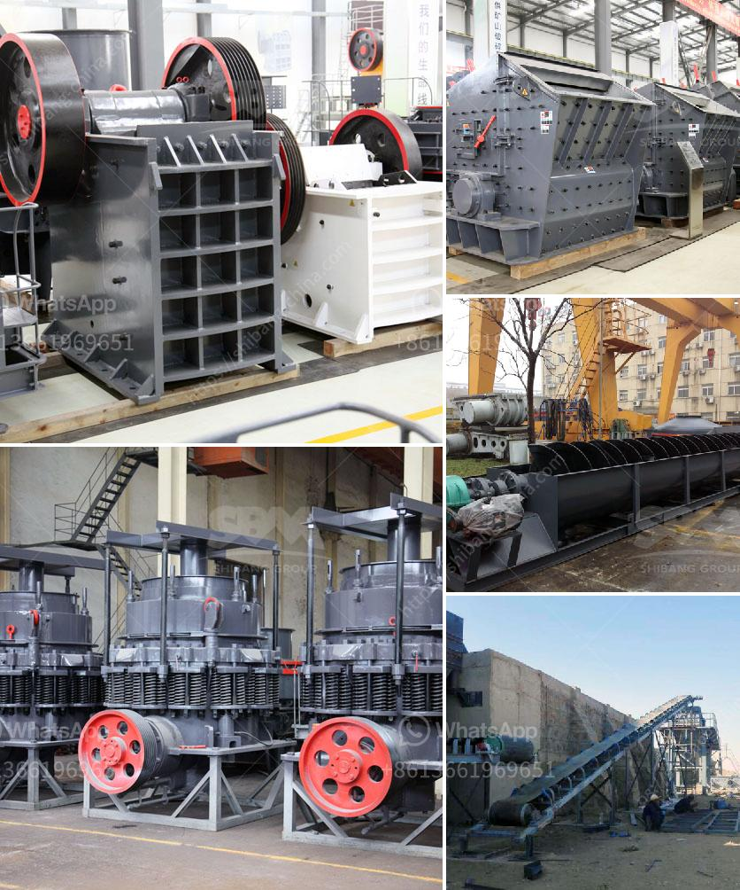

<h3>quartz powder making machine in andhra pradesh</h3>
Quartz is a mineral that is used in various industries for its physical and chemical properties. One of the most common uses of quartz is in the production of quartz powder, which is used in the manufacturing of glass, ceramics, and other industrial products. In Andhra Pradesh, there are several quartz powder making machine providers that manufacture and supply these machines to various industries.

These quartz powder making machines are essential for processing quartz into powder form. The process involves crushing quartz into different sizes that are further refined to obtain the desired particle size and shape. The machines used in this process are highly efficient and help in producing high-quality quartz powder.

One of the leading quartz powder making machine providers in Andhra Pradesh is ABC Machinery. They offer a wide range of quartz powder making machines that are designed to meet the specific needs of different industries. These machines are made using premium quality materials and advanced technology to ensure optimum performance and durability.

ABC Machinery's quartz powder making machines are known for their high efficiency and low maintenance requirements. They are equipped with advanced features and controls that enable easy operation and monitoring. The machines are also designed to minimize dust emissions and noise levels, ensuring a safe and clean working environment.

In addition to ABC Machinery, there are several other quartz powder making machine providers in Andhra Pradesh that offer similar machines. These providers understand the importance of quartz powder in various industries and strive to provide the best quality machines to meet the growing demand.

Overall, the availability of quartz powder making machines in Andhra Pradesh is a boon for industries that heavily rely on quartz powder for their manufacturing processes. These machines not only ensure the production of high-quality quartz powder but also contribute to the overall efficiency and productivity of the industry.
<h3>Contact us</h3><ul><li><strong>Whatsapp:&nbsp;<a href="https://wa.me/8613661969651">+8613661969651</a></strong></li><li><a href="https://swt.shibang-china.com/?git&amp;zhl&amp;quartz powder making machine in andhra pradesh"><strong>Online Service(chat now)</strong></a></li></ul><h3>Related</h3><ul><li><a href='coal wash plants for sale in malaysia.md'>coal wash plants for sale in malaysia</a></li><li><a href='list of machinery used for open pit mining.md'>list of machinery used for open pit mining</a></li><li><a href='impact crusher suppliers italy.md'>impact crusher suppliers italy</a></li><li><a href='hydraulic css control for jaw crusher.md'>hydraulic css control for jaw crusher</a></li><li><a href='advantages and disadvantages of a roll crusher.md'>advantages and disadvantages of a roll crusher</a></li></ul>