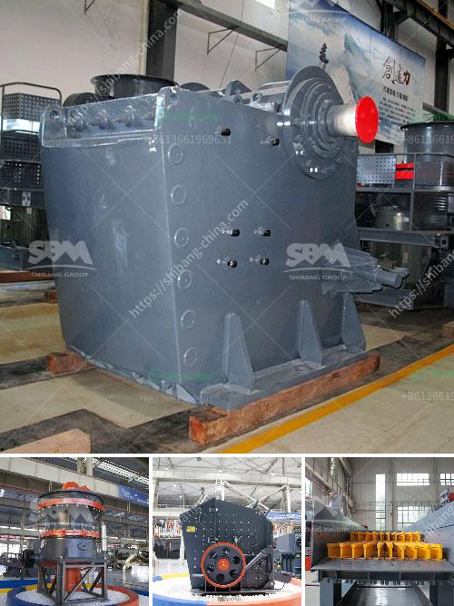

<h3>quartz powder making machinery</h3>
Quartz powder is a common raw material in the production of various industrial products. It is mainly used in the manufacturing of glass, ceramics, and refractories, among other industries. To produce high-quality quartz powder, manufacturers require advanced quartz powder making machinery.

Quartz powder making machinery is essential in the quartz powder manufacturing process. With high-quality equipment, the output of quartz powder is guaranteed to meet the production needs of various industries.

There are many types of quartz powder making machines on the market. Different machines have different specifications and applicable industries. Let's explore some of the most commonly used quartz powder making machinery:

1. Jaw Crusher: This machine is used to crush quartzite into smaller sizes suitable for entering the grinding mill. It is commonly used in the primary crushing stage of quartz ore.

2. Grinding Mill: The grinding mill is used to grind quartz into powder. In the grinding process, the quartz is ground to a fine powder, which can be adjusted according to the needs of different industries.

3. Air Classifier: The air classifier is used to separate the quartz powder from the coarse particles. It ensures that the final product is of high purity and meets the required particle size distribution.

4. Vibrating Screen: The vibrating screen is used to separate the quartz powder into different sizes. It helps to achieve uniform particle size distribution and improve the quality of the final product.

5. Dust Collector: The dust collector is used to collect dust generated during the quartz powder production process. It helps to create a clean and healthy working environment while minimizing the loss of valuable materials.

6. Packaging Machine: Once the quartz powder is produced, it needs to be packaged before being shipped to customers. The packaging machine ensures that the powder is properly sealed and preserved during transportation.

In addition to these machines, quartz powder making machinery may also include conveyors, storage bins, and other auxiliary equipment to facilitate the production process.

When choosing quartz powder making machinery, manufacturers should consider factors such as production capacity, energy consumption, maintenance requirements, and cost-effectiveness. It is also important to ensure that the machinery meets industry standards and regulations to produce high-quality quartz powder.

To conclude, quartz powder making machinery plays a crucial role in the production of quartz powder. With the right equipment, manufacturers can produce high-quality quartz powder that meets the needs of various industries. By investing in advanced machinery, manufacturers can improve production efficiency, reduce costs, and ensure the consistency and quality of their products.
<h3>Contact us</h3><ul><li><strong>Whatsapp:&nbsp;<a href="https://wa.me/8613661969651">+8613661969651</a></strong></li><li><a href="https://swt.shibang-china.com/?git&amp;zhl&amp;quartz powder making machinery"><strong>Online Service(chat now)</strong></a></li></ul><h3>Related</h3><ul><li><a href='china grove roller mill.md'>china grove roller mill</a></li><li><a href='mobile vibrating screens for hire in south africa.md'>mobile vibrating screens for hire in south africa</a></li><li><a href='aggregates crusher plant for sale in south africa.md'>aggregates crusher plant for sale in south africa</a></li><li><a href='gold mining production line or gold mining plant.md'>gold mining production line or gold mining plant</a></li><li><a href='used stone crusher nigeria.md'>used stone crusher nigeria</a></li></ul>