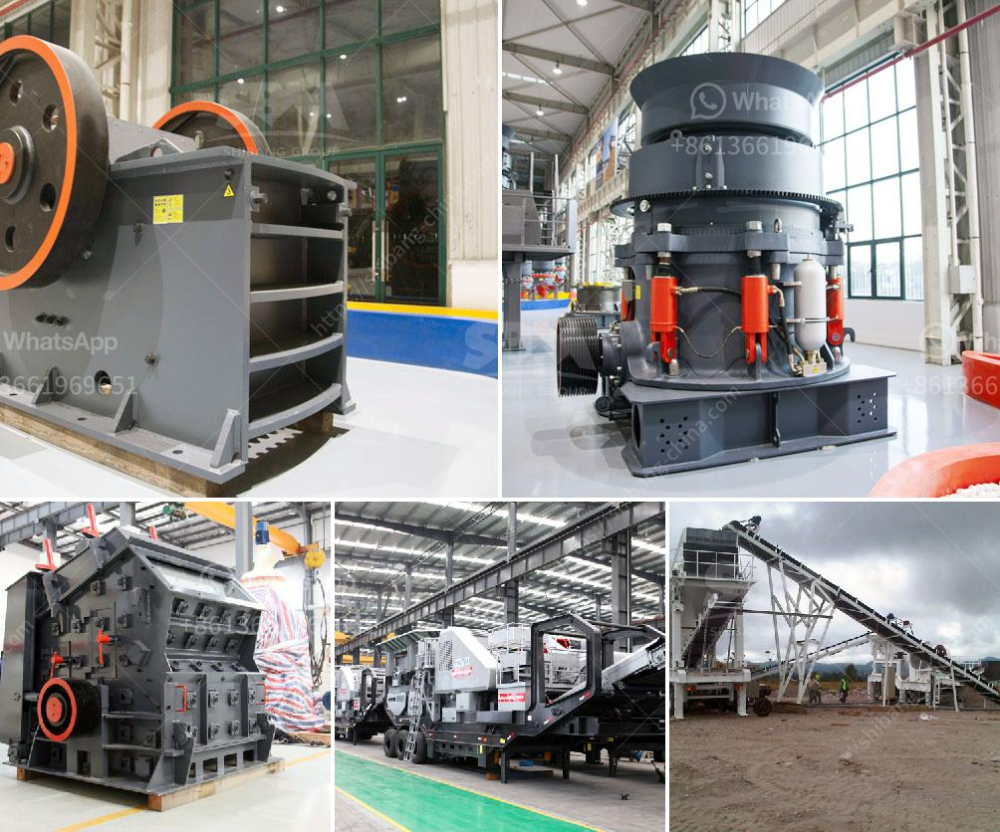

<h3>quartz powder making</h3>
Quartz powder, also known as silica powder, is a key ingredient in many industries. Quartz is a crystalline mineral that consists of silicon and oxygen atoms. It is highly abundant and has numerous applications due to its unique properties. One of the main uses of quartz powder is in the manufacturing of glass and ceramics.

The process of making quartz powder starts with extracting raw quartz from quarries or mines. The quartz is then crushed into smaller pieces to produce a fine powder. The crushing process involves using heavy machinery to grind the stone down into granules or smooth powders. These powders can be further processed and refined to meet specific requirements.

Quartz powder comes in a range of sizes, from coarse to fine. The size of the powder particles determines its applications. Coarser powders are used in construction materials, such as concrete and mortar, to enhance their strength and durability. Finer powders are used in various industries, including electronics, optics, and semiconductor manufacturing.

One of the key advantages of quartz powder is its high resistance to heat, chemicals, and electrical conductivity. It is also known for its high melting point, which makes it suitable for applications that involve extreme temperatures or harsh environments.

In the electronics industry, quartz powder is used to manufacture components such as quartz crystal oscillators, which are crucial in electronic devices like computers, smartphones, and telecommunication systems. The purity and consistency of the quartz powder is essential in ensuring the accuracy and reliability of these components.

In the cosmetics industry, quartz powder is used in the production of skincare products and makeup. It is added to foundations, powders, and blushes to provide a smooth and even texture, as well as absorb excess oil from the skin.

Overall, quartz powder is a versatile material with a wide range of applications. Its unique properties make it an essential ingredient in various industries, from construction to electronics and cosmetics. With its abundance and availability, quartz powder plays a crucial role in shaping our modern world.
<h3>Contact us</h3><ul><li><strong>Whatsapp:&nbsp;<a href="https://wa.me/8613661969651">+8613661969651</a></strong></li><li><a href="https://swt.shibang-china.com/?git&amp;zhl&amp;quartz powder making"><strong>Online Service(chat now)</strong></a></li></ul><h3>Related</h3><ul><li><a href='mobile crushers for sale south africa.md'>mobile crushers for sale south africa</a></li><li><a href='quartz powder making machinery.md'>quartz powder making machinery</a></li><li><a href='ball mill in china.md'>ball mill in china</a></li><li><a href='hammer mill equipment.md'>hammer mill equipment</a></li><li><a href='iron crushing plant in mexico.md'>iron crushing plant in mexico</a></li></ul>