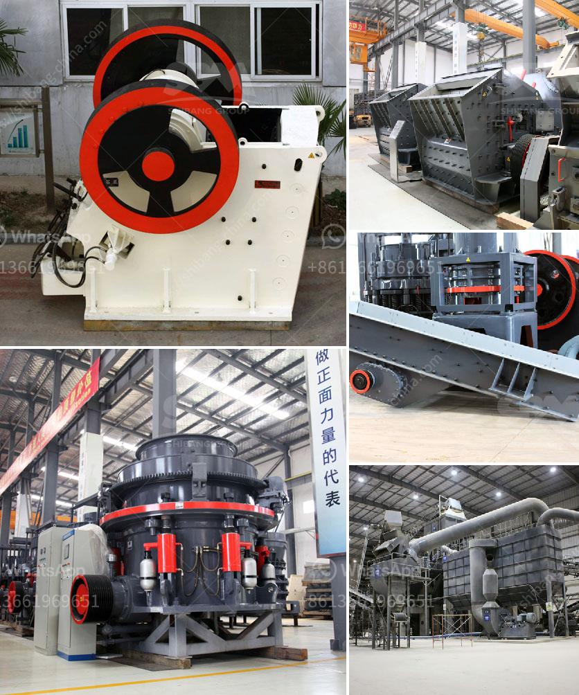

<h3>quartz silica pulverizer machine</h3>
Quartz silica, commonly known as silica sand, is a mineral composed primarily of silicon dioxide (SiO2). It is found in abundance in earth's crust and is used in various industrial applications due to its high purity and exceptional properties. One of the essential machines used in this industry is the quartz silica pulverizer machine.

A pulverizer is a machine that crushes or grinds materials into small pieces for various applications. The quartz silica pulverizer machine is specifically designed to grind quartz or silica materials into fine particles. This machine is used for processing these mineral ores for use in different industries, such as metallurgy, ceramics, construction, and chemical industry.

The machine has a robust construction, and it consists of several parts, including a feeding hopper, a grinding chamber, and an air classifier. The quartz silica material is fed into the machine through the hopper. The material then enters the grinding chamber, where high-speed rotating blades crush and grind it into fine particles. The air classifier helps to separate the fine particles from the coarser ones.

The pulverizer machine is equipped with advanced technology and features to ensure efficient and precise grinding. It has a powerful motor that provides the necessary energy for the grinding process. The machine also has a cooling system to prevent overheating and maintain the quality of the final product.

One of the key advantages of using a quartz silica pulverizer machine is its ability to produce finely ground particles. The machine is capable of grinding the quartz or silica material to a desired particle size, ranging from a few microns to a few millimeters. This allows the material to be used in various applications, such as in the production of glass, ceramics, and electronic components.

Another advantage of the machine is its high productivity and efficiency. The machine can process a large volume of material in a relatively short period. This makes it suitable for industries that require a constant supply of finely ground quartz silica material.

Moreover, the machine is easy to operate and requires minimal maintenance. It is designed to withstand the harsh conditions of industrial environments and can be operated without any specialized training or expertise. The machine also has a user-friendly interface, which allows operators to adjust various parameters and settings easily.

In conclusion, the quartz silica pulverizer machine is an essential machine for processing quartz or silica materials in various industries. It offers numerous benefits, including high productivity, efficiency, and the ability to produce finely ground particles. With its advanced technology and robust construction, the machine ensures reliable performance and long-term durability. If you are in the industry that requires quartz silica material, investing in a high-quality pulverizer machine is crucial for optimizing production and achieving consistent results.
<h3>Contact us</h3><ul><li><strong>Whatsapp:&nbsp;<a href="https://wa.me/8613661969651">+8613661969651</a></strong></li><li><a href="https://swt.shibang-china.com/?git&amp;zhl&amp;quartz silica pulverizer machine"><strong>Online Service(chat now)</strong></a></li></ul><h3>Related</h3><ul><li><a href='how much do rock crushers cost.md'>how much do rock crushers cost</a></li><li><a href='used stone cutting machine from japan.md'>used stone cutting machine from japan</a></li><li><a href='roller mill compontes.md'>roller mill compontes</a></li><li><a href='sand crusher company in nigeria.md'>sand crusher company in nigeria</a></li><li><a href='vertical shaft impact crushers.md'>vertical shaft impact crushers</a></li></ul>