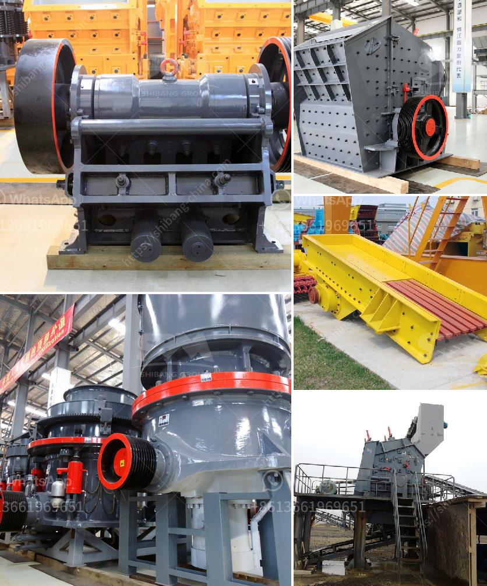

<h3>quartz stone crusher</h3>
Quartz, also known as engineered stone, is a man-made material that consists of crushed quartz particles bound together by resin. It is a popular alternative to natural stone countertops due to its durability and low maintenance requirements. But what exactly makes quartz stone crusher so popular? In this article, we will explore the reasons behind its increasing popularity in the construction and home improvement industry.

One of the main advantages of quartz stone crusher is its extreme hardness. This high level of hardness ensures that the surface is resistant to scratches and stains, making it an ideal choice for busy kitchens. Unlike natural stone such as granite or marble, quartz countertops do not require sealing and can withstand daily wear and tear without losing their luster. This makes it a practical and hassle-free option for homeowners who want a beautiful yet easy-to-maintain countertop.

Another reason why quartz stone crusher is in high demand is its wide range of color options. Quartz countertops come in a variety of colors, from neutrals like white and black to vibrant hues such as red and blue. This allows homeowners to choose a color that best suits their design style and complements their existing kitchen or bathroom décor. Moreover, the color of quartz countertops is consistent throughout the slab, unlike natural stone, which can have variations in color and pattern. This uniformity in color makes quartz a popular choice for those who desire a sleek and uniform look in their spaces.

Quartz stone crusher also offers a non-porous surface, which means it is resistant to bacteria, mold, and mildew. This makes it an ideal choice for environments where hygiene is crucial, such as kitchens and bathrooms. The non-porous nature of quartz countertops also makes them stain-resistant, as liquids and spills cannot penetrate the surface. This not only makes cleaning easier but also prevents the growth of bacteria and germs, contributing to a healthier living environment.

Additionally, quartz stone crusher is an eco-friendly material. Unlike natural stone, which requires mining and quarrying processes that can harm the environment, quartz is engineered using recycled materials. By making use of waste materials from other industries, quartz countertops reduce the environmental impact associated with mining and manufacturing. This makes it a sustainable choice for those who prioritize green living and want to reduce their carbon footprint.

In conclusion, quartz stone crusher offers a multitude of benefits that have contributed to its increasing popularity. Its extreme hardness, wide range of colors, non-porous surface, and eco-friendly nature make it an attractive option for homeowners and commercial designers alike. Whether you are seeking durability, aesthetic appeal, or low maintenance, quartz stone crusher should be at the top of your list when considering countertop options.
<h3>Contact us</h3><ul><li><strong>Whatsapp:&nbsp;<a href="https://wa.me/8613661969651">+8613661969651</a></strong></li><li><a href="https://swt.shibang-china.com/?git&amp;zhl&amp;quartz stone crusher"><strong>Online Service(chat now)</strong></a></li></ul><h3>Related</h3><ul><li><a href='gypsum powder machine for sale.md'>gypsum powder machine for sale</a></li><li><a href='egypt aggregate stone for concrete prices.md'>egypt aggregate stone for concrete prices</a></li><li><a href='stone crushing plant in pakistan.md'>stone crushing plant in pakistan</a></li><li><a href='stone quarry crusher in kasoa.md'>stone quarry crusher in kasoa</a></li><li><a href='mobile stone crusher machine price.md'>mobile stone crusher machine price</a></li></ul>