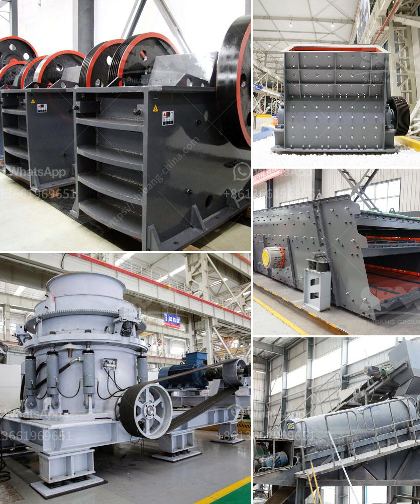

<h3>quartz stone crushers materials</h3>
Quartz stone crushers are widely used in mining, smelting, building materials, highways, railways, water conservancy and chemical industries. Choosing a suitable quartz stone crusher is very important for the production line. Factors such as feeding size, output size, motor power, and production capacity must be taken into consideration when selecting the appropriate model for crushing quartz stone.

Quartz stone is the main raw material for the production of quartz countertops. It is also the main raw material for various industries such as glass, ceramics, and electronics. Quartz stone can be crushed to produce quartz sand, which is an essential material in the production of glass and ceramics. High-purity quartz sand can also be used to make high-quality quartz materials, such as quartz crucibles, quartz tubes, and quartz rods. Quartz sand is widely used in the construction industry for various purposes, such as laying mortar, making concrete, and as a filler for coatings, plastics, and rubber.

In the process of quartz stone crushing, the following steps are usually followed: primary crushing, secondary crushing, and fine crushing. The primary crushing stage is accomplished by using a jaw crusher, which can crush the quartz stone into smaller sizes. The secondary crushing stage is done with a cone crusher or an impact crusher, depending on the requirements of the application. Finally, the quartz stone is crushed into fine particles by a vertical shaft impact crusher or a sand making machine.

The materials used in the production of quartz stone crushers are mainly steel, casting parts, and manganese steel. During the crushing process, the wear resistance of the crusher parts plays an important role. Therefore, choosing the appropriate materials for the parts is crucial for the crusher's performance and durability.

Steel is the most commonly used material for the body of quartz stone crushers. Steel has good toughness and high tensile strength, making it suitable for high-impact operations. As a result, steel is commonly used for the body and jaw plates of the quartz stone crushers.

Casting parts are another important component of quartz stone crushers. Casting parts are made by pouring molten metal into molds and allowing it to solidify. They are typically used for the main components of the crusher, such as the frame, adjustment device, and eccentric shaft. The use of casting parts ensures the strength and stability needed for the crusher's operation.

Manganese steel is often used for the wear-resistant parts of quartz stone crushers, such as the mantle and concave of cone crushers and the blow bars of impact crushers. Manganese steel has excellent wear resistance and high durability, making it suitable for harsh operating conditions.

In conclusion, choosing the right materials for quartz stone crushers is essential to ensure their performance and durability. Steel, casting parts, and manganese steel are commonly used materials for manufacturing quartz stone crushers. By selecting the appropriate materials for each component, quartz stone crushers can efficiently crush quartz stone into various sizes for different applications in the construction, glass, ceramic, and electronics industries.
<h3>Contact us</h3><ul><li><strong>Whatsapp:&nbsp;<a href="https://wa.me/8613661969651">+8613661969651</a></strong></li><li><a href="https://swt.shibang-china.com/?git&amp;zhl&amp;quartz stone crushers materials"><strong>Online Service(chat now)</strong></a></li></ul><h3>Related</h3><ul><li><a href='manufacturing artificial sand in malaysia.md'>manufacturing artificial sand in malaysia</a></li><li><a href='mill crusher pigment manufacturer in kenya.md'>mill crusher pigment manufacturer in kenya</a></li><li><a href='roller mill famsun.md'>roller mill famsun</a></li><li><a href='aggregate equipment for sale.md'>aggregate equipment for sale</a></li><li><a href='crusher equipment supplier.md'>crusher equipment supplier</a></li></ul>