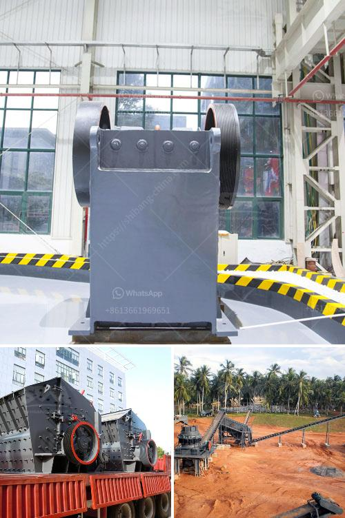

<h3>quartz stone pulverizer</h3>
Quartz stone pulverizer, also known as Raymond mill, is a commonly used grinding equipment in the field of mining. Quartz stone pulverizer has a good application relationship with quartz stone grinding. It can grind quartz stone into powder with different particle sizes.

Quartz stone pulverizer is mainly used in granite, quartz stone, sandstone, sedimentary rock, lime rock, cement clinker, activated carbon, dolomite, granite, gypsum, pyrophyllite and other hard non-metallic minerals with a hardness below 9.

The quartz stone pulverizer has the advantages of high grinding efficiency, low energy consumption, high safety, reliability, environmental protection and easy operation. Its fineness can reach 800-1200 mesh, which can fully meet the requirements of quartz stone powder in various industries.

The working principle of quartz stone pulverizer is as follows: the main unit of the machine rotates the roller assembly with the help of the speed reducer. The grinding roller assembly rotates around the central axis, and the grinding roller assembly is equipped with multiple grinding rolls, which are driven by the grinding roller. The material is fed into the grinding chamber through the feeding system, and is ground by the grinding roller assembly. After being ground, the material is blown into the powder concentrator by the air flow of the blower. The powder concentrator separates the qualified powder and the coarse powder, which are discharged through different pipelines. The qualified powder enters the collection system and is collected as the finished product, while the coarse powder is returned to the grinding chamber for regrinding.

The quartz stone pulverizer is widely used in the fields of metallurgy, construction, chemical industry, mining, highway construction, water conservancy and hydropower, refractory materials, ceramics, steel, thermal power plants, coal mines, cement plants and other industries. It is particularly suitable for processing quartz stone powder, which has high whiteness, high purity and uniform particle size distribution. It can be used as raw materials for ceramics, glass making, abrasives, casting, metallurgy, construction and other industries.

In recent years, with the rapid development of the quartz stone industry, the demand for quartz stone pulverizers has also increased significantly. Quartz stone pulverizers with different specifications and models have been put into use in various production lines. With its excellent performance and reliable operation, it has won the favor of many customers.

In summary, quartz stone pulverizer is an important equipment for quartz stone grinding. It can grind quartz stone into powder with different particle sizes, which has a wide range of applications in various industries. With the continuous improvement of technology, the performance of quartz stone pulverizer is constantly optimized, which provides a strong guarantee for the efficient and stable production of quartz stone powder.
<h3>Contact us</h3><ul><li><strong>Whatsapp:&nbsp;<a href="https://wa.me/8613661969651">+8613661969651</a></strong></li><li><a href="https://swt.shibang-china.com/?git&amp;zhl&amp;quartz stone pulverizer"><strong>Online Service(chat now)</strong></a></li></ul><h3>Related</h3><ul><li><a href='magnesite processing plant.md'>magnesite processing plant</a></li><li><a href='plans for making a miniature jaw crusher.md'>plans for making a miniature jaw crusher</a></li><li><a href='chrome washing plant for sale.md'>chrome washing plant for sale</a></li><li><a href='granite and marble factory for sale.md'>granite and marble factory for sale</a></li><li><a href='industrial mining jaw crushers south africa.md'>industrial mining jaw crushers south africa</a></li></ul>