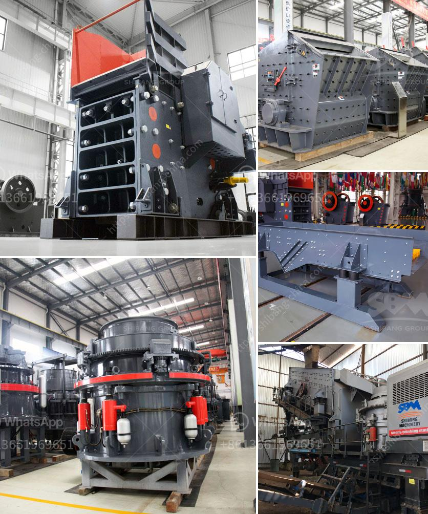

<h3>quartz stone quarry crusher in nigeria</h3>
Quartz stone quarry crusher in Nigeria is one of the most useful and versatile materials found in earth's crust. Used in a variety of industries, quartz stone offers excellent durability, strength, and thermal conductivity. The demand for quartz stone is constantly increasing in Nigeria as it is used in the construction industry, personal care products, electronic devices, and more.

Quartz stone quarry crusher in Nigeria is finally designed for crushing and breaking processes in Nigeria. For Nigeria mineral mining, including Talc ore, Gypsum Plaster, Iron ore, Lead/Zinc Ore, Bentonite, Barite, Gold Ore, Asphalt, Coal, Quartz Stone, and Kaolin, some investors express that in order to expand their business scale or have a better development prospect, they would choose to quarry the quartz stone.

The quartz stone quarry crusher in Nigeria mainly consists of jaw crusher, impact crusher, cone crusher, VSI crusher, vibrating feeder, vibrating screen, belt conveyor and control system, etc. It is completely capable to crush and screen limestone, marble, granite, basalt, river stone, and so on, and produce sand & gravels with various granularities for construction and building industry.

Quartz stone quarry crusher in Nigeria is widely used for the crushing of over 150 kinds of stones, such as limestone, granite, aggregate, basalt, gravel, quartz, pebble, gold stone,etc in mining, quarry, construction and other industries. The main materials are limestone, river stone, pebble, gravel, quartz stone, phosphate rock, basalt, calcite, barite, gypsum, dolomite, etc.

The quartz stone quarry crusher in Nigeria depends on diversified crushing and screening operation. The raw material will be crushed from different sizes into required sizes in the crushing chamber. The final sizes can be controlled through adjusting the discharge port. Construction industry needs different sizes of stones and it requires a certain level of precision.

The quartz stone quarry crusher in Nigeria needs high crushing ratio and production efficiency, and can be used as fine crushing and screening machine to do fine crushing and screening in sand production line. The improved impact crusher has enhanced the overall performance and widely used in sand and stone production, highway, railway, and other industries.

Quarrying process is generally carried out in the open, the quarried stone is normally run through a primary crusher and then through secondary crushers to produce angular fragments in a variety of sizes. The final product is then screened to separate the suitable sizes for the end users.

Quartz stone quarry crusher in Nigeria is finally designed for crushing and breaking processes in Nigeria. Its crushing ratio is 4-6, and the fineness factor is even. Cone crusher is an advanced crusher developed by a leading company in the introduction of foreign advanced technology. The demands for cone crusher for granite crushing plant in Nigeria are escalating, which contributes greatly to the development of the Nigerian quarry market.

Therefore, quartz stone quarry crusher in Nigeria is urgently needed to increase the output and market competitiveness of quartz stones in Nigeria. In order to achieve a win-win situation, the Nigerian government should implement policies to attract more mining investors and provide them with a favorable investment environment. With the continuous development of infrastructure construction, the demand for quartz stone in Nigeria will continue to rise, which will promote the development of the quartz stone quarry crusher industry.
<h3>Contact us</h3><ul><li><strong>Whatsapp:&nbsp;<a href="https://wa.me/8613661969651">+8613661969651</a></strong></li><li><a href="https://swt.shibang-china.com/?git&amp;zhl&amp;quartz stone quarry crusher in nigeria"><strong>Online Service(chat now)</strong></a></li></ul><h3>Related</h3><ul><li><a href='silica sand production using ball mill in dubai.md'>silica sand production using ball mill in dubai</a></li><li><a href='mobile crushers for sale in south africa.md'>mobile crushers for sale in south africa</a></li><li><a href='grinding ball mills type p500.md'>grinding ball mills type p500</a></li><li><a href='process of crushing granite.md'>process of crushing granite</a></li><li><a href='stone crushing plant th hard rock.md'>stone crushing plant th hard rock</a></li></ul>