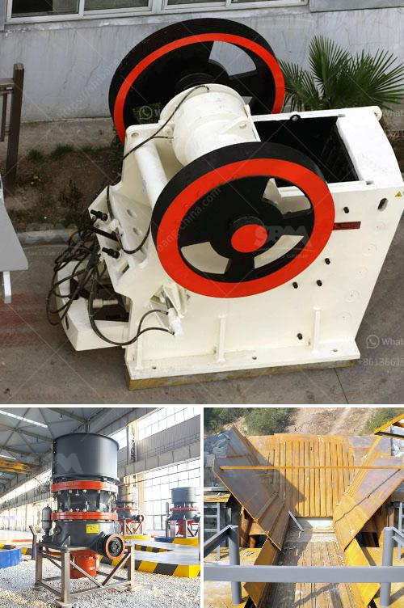

<h3>quotation for minimum quary plant</h3>
Quarry plants are essential for the mining industry as they play a vital role in extracting and processing raw materials. However, setting up a quarry plant can be a costly endeavor, requiring substantial investment. For individuals or companies looking to start small or operate on a tight budget, it is crucial to find a quotation for a minimum quarry plant that meets their needs.

The first step in obtaining a quotation for a minimum quarry plant is to determine the specific requirements of the operation. Evaluating factors such as the type of material to be extracted, the desired production capacity, and the necessary equipment will help identify the essentials for the quarry plant.

Once the requirements are established, it is time to approach suppliers and manufacturers to gather quotations. A reliable approach is to contact multiple vendors to compare prices and to ensure that the chosen suppliers are credible and reputable.

A minimum quarry plant typically includes the basic equipment necessary for mining operations. This may consist of crushers, screens, conveyors, and loaders. These machines are crucial for extracting raw materials, segregating different sizes, and moving materials around the site.

When reviewing quotations, it is essential to consider not only the upfront cost of the quarry plant but also any additional expenses that may arise. This includes transportation, installation, and ongoing maintenance costs. It is advisable to opt for suppliers who provide comprehensive packages that cover these aspects, as it ensures a smooth and hassle-free transition to operational activity.

Moreover, it is crucial to discuss warranty options and after-sales support before finalizing any decisions. Understanding the warranty terms, duration, and coverage will provide peace of mind in case of unexpected faults or breakdowns.

Ultimately, obtaining a quotation for a minimum quarry plant involves careful planning, research, and evaluation. It is important to strike a balance between affordability and reliability to ensure the longevity and efficiency of the operation. By considering the specific requirements, comparing multiple quotations, and choosing a reputable supplier, individuals and companies can successfully embark on their quarrying venture within their budget constraints.

In conclusion, finding a quotation for a minimum quarry plant is crucial for those aiming to start small or operate on a tight budget. Through diligent research and evaluation, individuals or companies can secure a quotation that meets their specific requirements while staying within their financial limitations. By considering essential factors such as equipment, additional expenses, and after-sales support, a successful and sustainable quarry operation can be established.
<h3>Contact us</h3><ul><li><strong>Whatsapp:&nbsp;<a href="https://wa.me/8613661969651">+8613661969651</a></strong></li><li><a href="https://swt.shibang-china.com/?git&amp;zhl&amp;quotation for minimum quary plant"><strong>Online Service(chat now)</strong></a></li></ul><h3>Related</h3><ul><li><a href='feldspar crusher price.md'>feldspar crusher price</a></li><li><a href='working of hydraulic circuit for milling machine.md'>working of hydraulic circuit for milling machine</a></li><li><a href='flow chart of three stage agreegate crushing plant.md'>flow chart of three stage agreegate crushing plant</a></li><li><a href='ball mill diagram for cement grinding.md'>ball mill diagram for cement grinding</a></li><li><a href='industrial roller ball mill.md'>industrial roller ball mill</a></li></ul>