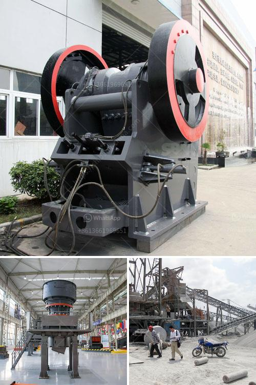

<h3>quote conical vertical impact crusher</h3>
The conical vertical impact crusher, also known as sand maker, is a highly efficient tool for producing aggregate materials. With advanced hydraulic technology, conical vertical impact crushers are designed to break all kinds of hard rocks and provide fine sand for construction purposes. This innovative equipment is becoming increasingly popular within the construction industry due to its numerous advantages and ease of use.

One of the key features of the conical vertical impact crusher is its ability to produce fine sand with high crushing efficiency. The crusher uses a unique rock-on-rock crushing technique, which maximizes the impact energy within the material. This results in better-shaped particles and higher reduction ratios compared to traditional crushers. With this technology, the conical vertical impact crusher ensures a consistent and reliable supply of quality aggregate materials.

Another notable advantage of this crusher is its versatility. It can handle various types of rocks, including hard and abrasive ones. The adjustable rotor speed and impact curtain allow operators to optimize the crusher's performance for different materials and desired end products. This flexibility ensures that the crusher can be utilized for a wide range of applications, from road construction and railway ballast production to the manufacturing of concrete and asphalt.

Additionally, conical vertical impact crushers are designed for low maintenance and easy operation. The advanced hydraulic system provides automatic overload protection, preventing any damage to the crusher and guaranteeing its longevity. Furthermore, the crusher is equipped with a state-of-the-art control system, allowing operators to monitor and adjust the crusher's performance in real-time.

It's worth mentioning that the conical vertical impact crusher is also environmentally friendly. Its efficient crushing process reduces the amount of waste generated and allows for the recycling of materials. This not only reduces the environmental impact but also cuts down on costs associated with waste disposal.

In conclusion, the conical vertical impact crusher is a revolutionary tool in the aggregates production industry. Its innovative design, high crushing efficiency, versatility, and low maintenance make it an ideal choice for various construction projects. Investing in this advanced equipment will undoubtedly enhance productivity, improve product quality, and contribute to a more sustainable approach to the aggregates industry.
<h3>Contact us</h3><ul><li><strong>Whatsapp:&nbsp;<a href="https://wa.me/8613661969651">+8613661969651</a></strong></li><li><a href="https://swt.shibang-china.com/?git&amp;zhl&amp;quote conical vertical impact crusher"><strong>Online Service(chat now)</strong></a></li></ul><h3>Related</h3><ul><li><a href='calcium carbonate grinding plant feasibility.md'>calcium carbonate grinding plant feasibility</a></li><li><a href='ballast crushing equipment.md'>ballast crushing equipment</a></li><li><a href='coal washing machine for sale.md'>coal washing machine for sale</a></li><li><a href='mining machinery manufacturer in italy.md'>mining machinery manufacturer in italy</a></li><li><a href='products pe jaw crusher.md'>products pe jaw crusher</a></li></ul>