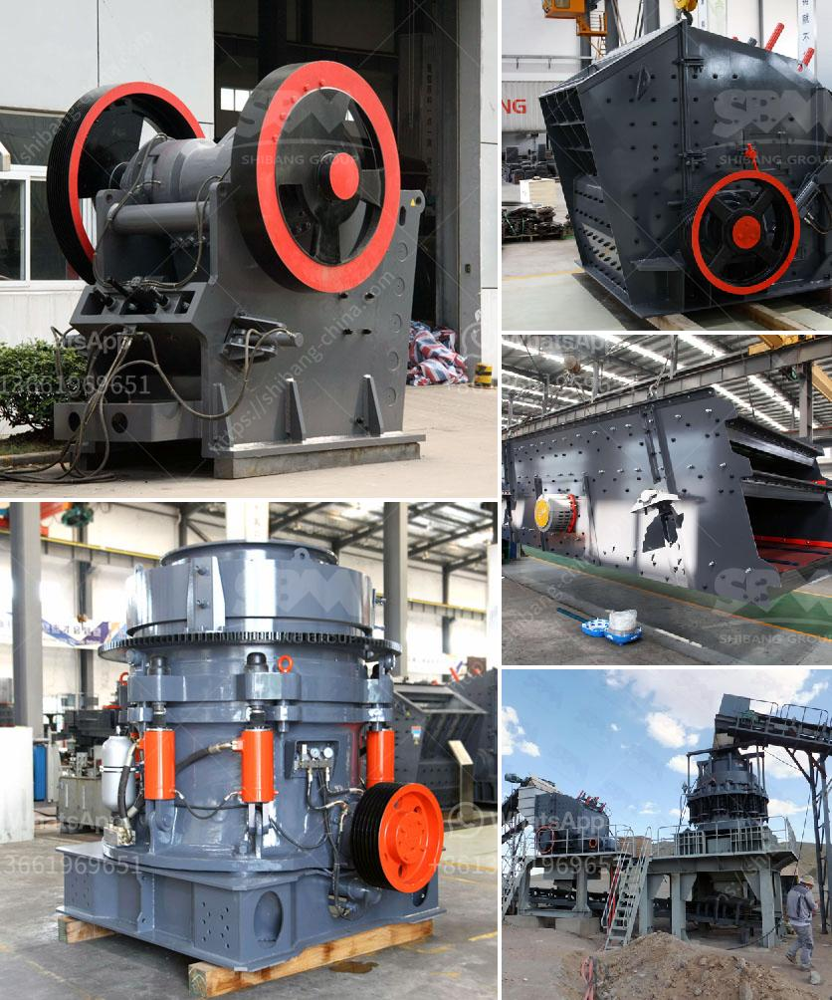

<h3>raymond bowl coal mill drawings</h3>
The Raymond Bowl coal mill is an essential piece of equipment for the coal-fired power plant. It produces powdered coal that is used for combustion in the power generation process. The machine has been in operation since the early 20th century and has evolved to become more efficient, reliable, and versatile.

The Raymond Bowl mill is notorious for its durability and reliability. Alongside its low maintenance and power consumption, this machine has a long history of dependability. As coal is pulverized by grinding rollers, it is blown into the combustion chamber for immediate combustion. The mill's components are designed in such a way that they can withstand high temperatures, corrosive materials, and extreme operating conditions.

Drawing and design are vital stages in developing the Raymond Bowl mill's components. The detailed drawings provide engineers with precise measurements and specifications for manufacturing and assembling the different parts. These drawings ensure accuracy during fabrication and assembly, guaranteeing that the end product will meet the required performance standards.

Raymond Bowl coal mill drawings include a complete set of drawings, including general arrangement, assemblies, and detailed drawings of mill components. These provide a clear visual representation of the mill's structure, enabling engineers to understand its design and function better. The drawings also serve as a reference for maintenance and repairs, as they highlight the location and interaction of various components.

In conclusion, the Raymond Bowl coal mill is a significant equipment in the power generation process. Its durability, reliability, and efficiency are the result of meticulous design and engineering. The detailed drawings associated with the machine ensure accuracy during fabrication and assembly, as well as providing a reference for maintenance and repairs. With its long history of success, the Raymond Bowl coal mill continues to be a critical component in the coal-fired power plant industry.
<h3>Contact us</h3><ul><li><strong>Whatsapp:&nbsp;<a href="https://wa.me/8613661969651">+8613661969651</a></strong></li><li><a href="https://swt.shibang-china.com/?git&amp;zhl&amp;raymond bowl coal mill drawings"><strong>Online Service(chat now)</strong></a></li></ul><h3>Related</h3><ul><li><a href='small ball mill price.md'>small ball mill price</a></li><li><a href='dicalcium phosphate process hydrochloric acid flow chart.md'>dicalcium phosphate process hydrochloric acid flow chart</a></li><li><a href='vibro screen machine in ahmedabad.md'>vibro screen machine in ahmedabad</a></li><li><a href='stone crusher seller.md'>stone crusher seller</a></li><li><a href='mobile crusher plant price in india.md'>mobile crusher plant price in india</a></li></ul>