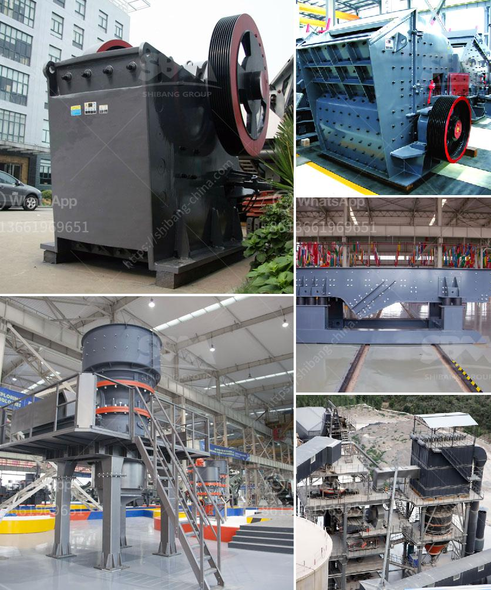

<h3>raymond gypsum mill in india</h3>
India is a country with abundant resources of gypsum, which is one of the most important minerals for industrial use. Gypsum is widely used in various industries such as construction, building materials, ceramics, pottery, metallurgy, and chemical. In order to meet the high demand for gypsum, the Indian government has accelerated the pace of gypsum mining. Gypsum mines are mainly distributed in Rajasthan, Gujarat, Jammu and Kashmir, Himachal Pradesh, and Tamil Nadu.

However, raw gypsum ore could not be directly used in the construction and other industries as it needs to be ground into powder with different fineness for various applications. Raymond mill is the most commonly used grinding mill for gypsum grinding process, which has a simple structure and reliable operation. In India, Raymond mill is used with crushing machine for grinding dolomite stones into powder.

1. The whole plant is a vertical structure of strong systematic characteristic, so it occupies small area. From crushing of raw material to grinding and packing is an independent production system.

2. Compared with other milling plants, its passing ratio achieves 99%, which is what other mills cannot reach.

3. Driving system of main frame adopts airtight gearing and pulley, drives smoothly, and operates reliably.

4. Main parts of the whole plant are made from cast and steel of high quality. The technics is so subtly that insures the durability of whole plant.

5. The electric control system is centralized controlled, so the automaticity is high, no people are needed in the operating room.

6. The fine powder enters the Cyclone Powder Collector and is discharged through the powder discharging pipe to be the final products.

As a professional mining equipment manufacturer in China, Machinery has different models of Raymond mill for customers to choose from. Its fineness of finished products can be adjusted from 80 to 325 meshes according to requirements. With the features of high efficiency, energy-saving, and environment-friendly, Raymond mill has been widely used in industries like mining, cement, metallurgy, construction materials, and chemical engineering.

In recent years, India's gypsum grinding mill has been widely used in various fields. First, its production capacity has been improved, greatly expanding the scope of application in the gypsum industry. Second, the new Raymond mill equipment is more environmentally friendly, low noise, and dust-free, meeting the national environmental protection requirements. Third, the market price of gypsum powder is stable, and the profit margin has been further improved.

In summary, Raymond mill is an essential grinding equipment for gypsum in India. Its output, quality, and grinding efficiency are among the highest in the industry. With the continuous expansion of the gypsum market in India, the demand for this equipment will continue to increase, making Raymond mill popular in the Indian market. Machinery, as a reliable and professional Raymond mill manufacturer, will continue to provide customers with high-quality equipment and excellent service to meet the growing demand for gypsum processing in India.
<h3>Contact us</h3><ul><li><strong>Whatsapp:&nbsp;<a href="https://wa.me/8613661969651">+8613661969651</a></strong></li><li><a href="https://swt.shibang-china.com/?git&amp;zhl&amp;raymond gypsum mill in india"><strong>Online Service(chat now)</strong></a></li></ul><h3>Related</h3><ul><li><a href='100 tph stone crusher plant specifications.md'>100 tph stone crusher plant specifications</a></li><li><a href='vertical shaft impact crushers.md'>vertical shaft impact crushers</a></li><li><a href='manufacturer of crushing equipment philippines.md'>manufacturer of crushing equipment philippines</a></li><li><a href='standard crushed stone sizes.md'>standard crushed stone sizes</a></li><li><a href='rock crusher unit.md'>rock crusher unit</a></li></ul>