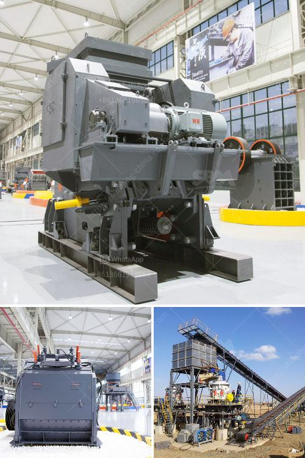

<h3>raymond mill coal pulverizer</h3>
Raymond mill is one of the most commonly used pulverizing equipment in the industrial field. Raymond mill itself has the characteristics of high efficiency in the production of powder, that is, it can quickly process more than 300 kinds of minerals or ores, and the fineness of the finished product is uniform, the screening rate is high, and the operating efficiency is greatly improved.

Firstly, the fineness of Raymond mill coal pulverizer can be adjusted flexibly, depending on the user's requirements. With the fineness analyzer, the final product size can be easily controlled. Moreover, the dust removal equipment equipped with Raymond mill can effectively reduce the dust pollution, meeting the environmental protection requirements.

Secondly, the unique design of the grinding roller and grinding ring of Raymond mill coal pulverizer improves the grinding efficiency and reduces the energy consumption. The high pressure spring system can provide strong pressure, which can effectively increase the capacity and improve the grinding fineness.

Thirdly, the main engine adopts the full sealed gear box and pulley system, which reduces the transmission loss and improves the transmission efficiency. This design can effectively extend the service life of the equipment and reduce maintenance and repair costs.

Lastly, the operation of Raymond mill coal pulverizer is simple and convenient. The centralized control system can realize remote control, reduce labor costs, and improve operating efficiency.

In conclusion, Raymond mill coal pulverizer is a versatile and reliable grinding equipment that can effectively improve processing efficiency and reduce energy consumption. The above characteristics make Raymond mill coal pulverizer become the ideal equipment in coal industry, enabling enterprises to save production costs and achieve efficient operation.
<h3>Contact us</h3><ul><li><strong>Whatsapp:&nbsp;<a href="https://wa.me/8613661969651">+8613661969651</a></strong></li><li><a href="https://swt.shibang-china.com/?git&amp;zhl&amp;raymond mill coal pulverizer"><strong>Online Service(chat now)</strong></a></li></ul><h3>Related</h3><ul><li><a href='technical parametres of impact crusher.md'>technical parametres of impact crusher</a></li><li><a href='mica grinding mill.md'>mica grinding mill</a></li><li><a href='impact coal crusher.md'>impact coal crusher</a></li><li><a href='gypsum plant unit and utilities.md'>gypsum plant unit and utilities</a></li><li><a href='cost of setting up a quarry crusher.md'>cost of setting up a quarry crusher</a></li></ul>