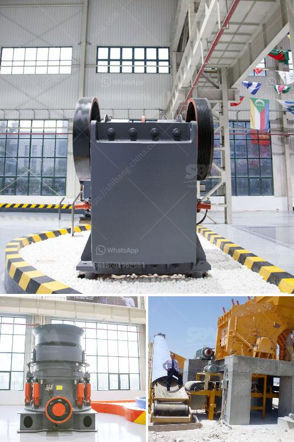

<h3>raymond mill grinding</h3>
Grinding is an important process in many industries, such as mining, cement, metallurgy, and chemicals. Despite its importance, not many people are aware of the full potential of grinding and the equipment used to facilitate it. One such equipment that has gained significant recognition among professionals is the Raymond mill. In this article, we will explore the benefits and features of Raymond mill grinding.

Raymond mill, also known as Raymond roller mill, is a widely used and highly efficient grinding equipment. It is mainly used for grinding materials in industries such as metallurgy, building materials, chemical engineering, mining, and more. It has a wide range of applications, making it an ideal choice for processing a variety of non-flammable and non-explosive materials with hardness less than 7 and humidity less than 6%.

One of the key advantages of Raymond mill grinding is its high grinding efficiency. This mill uses a centrifugal force-driven roller swing outward, pressing the grinding ring, resulting in a grinding efficiency of between 30 and 40%. The grinding roller compresses the grinding ring under the action of centrifugal force, thereby achieving the grinding effect.

Another essential feature of Raymond mill is its ability to control the fineness of the finished products. By adjusting the rotational speed of the classifier, particle size can be easily adjusted. Furthermore, the Raymond mill can also be equipped with a classifier to improve the fineness of the finished product. With a wide range of particle sizes achievable, Raymond mill offers great flexibility in terms of product specifications.

Raymond mill is also known for its simplified design, robust construction, and reliable operation. It integrates drying, grinding, and classifying processes into one unit, reducing the need for auxiliary machines and lowering production costs. The machine has a compact footprint, making it an ideal choice for smaller spaces.

Maintenance of Raymond mill is relatively easy. The lubrication system is part of the mill, ensuring proper lubrication of all the machine's components. Additionally, the machine is equipped with a dust removal device, reducing the dust pollution during grinding operations and ensuring a clean and safe working environment.

In conclusion, Raymond mill grinding is an ideal choice for industries requiring high grinding efficiency and control over fineness. With its simplified design, robust construction, and reliable performance, it is becoming an indispensable equipment in numerous industries. Whether for processing non-flammable or non-explosive materials, Raymond mill offers a high level of flexibility and efficiency. So, if you are looking for a grinding powerhouse for your industry, look no further than Raymond mill.
<h3>Contact us</h3><ul><li><strong>Whatsapp:&nbsp;<a href="https://wa.me/8613661969651">+8613661969651</a></strong></li><li><a href="https://swt.shibang-china.com/?git&amp;zhl&amp;raymond mill grinding"><strong>Online Service(chat now)</strong></a></li></ul><h3>Related</h3><ul><li><a href='iron ore crushing and screening.md'>iron ore crushing and screening</a></li><li><a href='iron ore beneficiation plants price in china.md'>iron ore beneficiation plants price in china</a></li><li><a href='activated carbon plant for sale.md'>activated carbon plant for sale</a></li><li><a href='small jaw crusher uk.md'>small jaw crusher uk</a></li><li><a href='price of raymond used for crushing the powder stones.md'>price of raymond used for crushing the powder stones</a></li></ul>