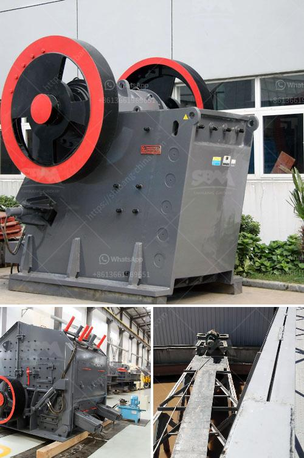

<h3>raymond mill india</h3>
In today's industrial sector, grinding processes are crucial for several applications. From cement industries to power plants, grinding is an essential process that enhances efficiency and productivity. Raymond mill, also known as Raymond grinding mill, has gained popularity and recognition in recent years due to its high flexibility, cost-effectiveness, and strong adaptability.

The Raymond mill, invented by the American engineer Raymond Roller, is widely used for grinding non-flammable and non-explosive materials such as barite, calcite, potassium feldspar, talc, marble, limestone, dolomite, fluorite, lime, activated clay, activated carbon, bentonite, kaolin, cement, phosphate rock, gypsum, glass, insulation materials, etc. This versatile mill can grind and process various minerals and materials with Mohs hardness up to 9.3 and humidity below 6%.

India, being one of the fastest-growing economies globally, requires efficient and reliable grinding solutions to meet the ever-increasing demand. Raymond mill has become an essential tool in India's grinding industry due to its compact design, high efficiency, low power consumption, and unmatched performance. 

One of the significant advantages of the Raymond mill is its ability to grind materials into an extremely fine powder. The mill's high grinding efficiency ensures a uniform and stable particle size distribution, making it suitable for various industries that demand precise and consistent results. This feature is particularly crucial in industries like cement, where the proper particle size plays a vital role in determining the quality and strength of the final product.

Another notable advantage of the Raymond mill is its low energy consumption. In today's environmentally-conscious era, reducing energy consumption is a key priority. The Raymond mill is designed with energy-saving features that minimize power consumption while maintaining optimal grinding performance. This not only helps in reducing operational costs but also contributes to sustainable development by minimizing the overall carbon footprint.

Furthermore, the Raymond mill offers exceptional durability and long service life. The robust construction and high-quality components of the mill ensure reliable and trouble-free operation, even under demanding conditions. This reliability factor makes it a preferred choice for industries in India that require continuous grinding operations.

The Raymond mill is also highly versatile, allowing operators to adjust various parameters such as grinding pressure, main airflow volume, grinding temperature, etc. This flexibility enables users to achieve precise control over the grinding process and obtain the desired product characteristics. Additionally, the mill's modular design allows for easy maintenance and quick replacement of worn-out parts, minimizing downtime and ensuring uninterrupted production.

In conclusion, the Raymond mill has revolutionized the grinding industry in India by providing a cost-effective, energy-efficient, and flexible solution. Its ability to produce consistent, high-quality products with fine particle size distribution makes it an invaluable tool for various industries. With the Raymond mill, Indian industries can now achieve higher productivity, reduced costs, and improved product quality, thus further strengthening the country's industrial capabilities.

As the demand for grinding solutions continues to rise, the Raymond mill remains at the forefront, meeting the evolving needs of the Indian market. Its exceptional performance, reliability, and versatility make it an indispensable asset for any industry seeking efficient grinding solutions.
<h3>Contact us</h3><ul><li><strong>Whatsapp:&nbsp;<a href="https://wa.me/8613661969651">+8613661969651</a></strong></li><li><a href="https://swt.shibang-china.com/?git&amp;zhl&amp;raymond mill india"><strong>Online Service(chat now)</strong></a></li></ul><h3>Related</h3><ul><li><a href='price of gypsum processing plant.md'>price of gypsum processing plant</a></li><li><a href='mobile crushing machines.md'>mobile crushing machines</a></li><li><a href='belt conveyor untuk batubara.md'>belt conveyor untuk batubara</a></li><li><a href='crush plant prices in pakistan.md'>crush plant prices in pakistan</a></li><li><a href='aggregates for concrete crusher in nigeria.md'>aggregates for concrete crusher in nigeria</a></li></ul>