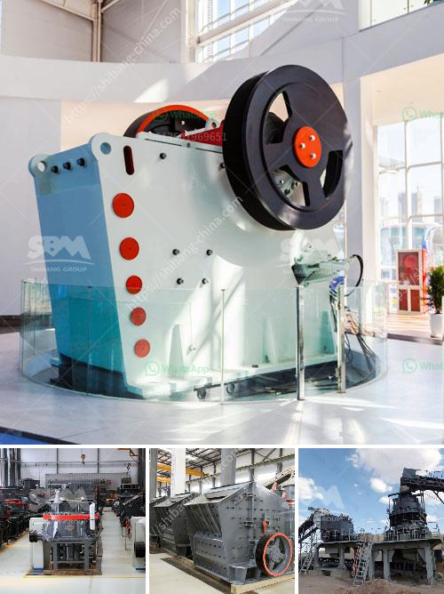

<h3>raymond pulverizer mill pdf</h3>
The Raymond Pulverizer Mill is a highly efficient and versatile grinding unit that offers the perfect solution for both the solid fuel and industrial minerals markets. It can be used in processes involving materials such as limestone, calcite, marble, barite, dolomite, gypsum, talc, diabase, quartz, bentonite, etc. The mill is well-known for its ability to grind materials with a hardness of up to 9.3 Mohs.

One of the key features of the Raymond Pulverizer Mill is its high-efficiency cyclone collector. This collector ensures that the fine powders generated during the grinding process are efficiently separated from the air, resulting in a clean and dust-free working environment. Additionally, the collector plays a significant role in maintaining the mill's overall performance by preventing the accumulation of excessive material inside the grinding chamber.

Another notable feature of the Raymond Pulverizer Mill is its advanced control system. It is equipped with a PLC control system, enabling operators to monitor and control various parameters such as grinding pressure, temperature, and airflow. This level of control ensures that the mill operates optimally, maximizing productivity and minimizing downtime.

Moreover, the Raymond Pulverizer Mill's design incorporates several safety features to guarantee the wellbeing of operators and protect the machine itself. These features include an emergency stop button, a safety interlock system, and an automatic fire suppression system, providing peace of mind and reassurance in terms of workplace safety.

In conclusion, the Raymond Pulverizer Mill is a versatile and efficient grinding solution that caters to various industries. Its ability to handle a wide range of materials, coupled with its high-efficiency cyclone collector and advanced control system, make it a favorable choice for any grinding process. With its strong emphasis on safety, this mill ensures both operator comfort and machine protection. Whether it's solid fuel or industrial minerals, the Raymond Pulverizer Mill proves to be a reliable and effective option.
<h3>Contact us</h3><ul><li><strong>Whatsapp:&nbsp;<a href="https://wa.me/8613661969651">+8613661969651</a></strong></li><li><a href="https://swt.shibang-china.com/?git&amp;zhl&amp;raymond pulverizer mill pdf"><strong>Online Service(chat now)</strong></a></li></ul><h3>Related</h3><ul><li><a href='gravel crushers in bc.md'>gravel crushers in bc</a></li><li><a href='mill crusher pigment manufacturer in kenya.md'>mill crusher pigment manufacturer in kenya</a></li><li><a href='quartz powder making machine in andhra pradesh.md'>quartz powder making machine in andhra pradesh</a></li><li><a href='petroleum coke crushing plant.md'>petroleum coke crushing plant</a></li><li><a href='manufacturing process of cement.md'>manufacturing process of cement</a></li></ul>