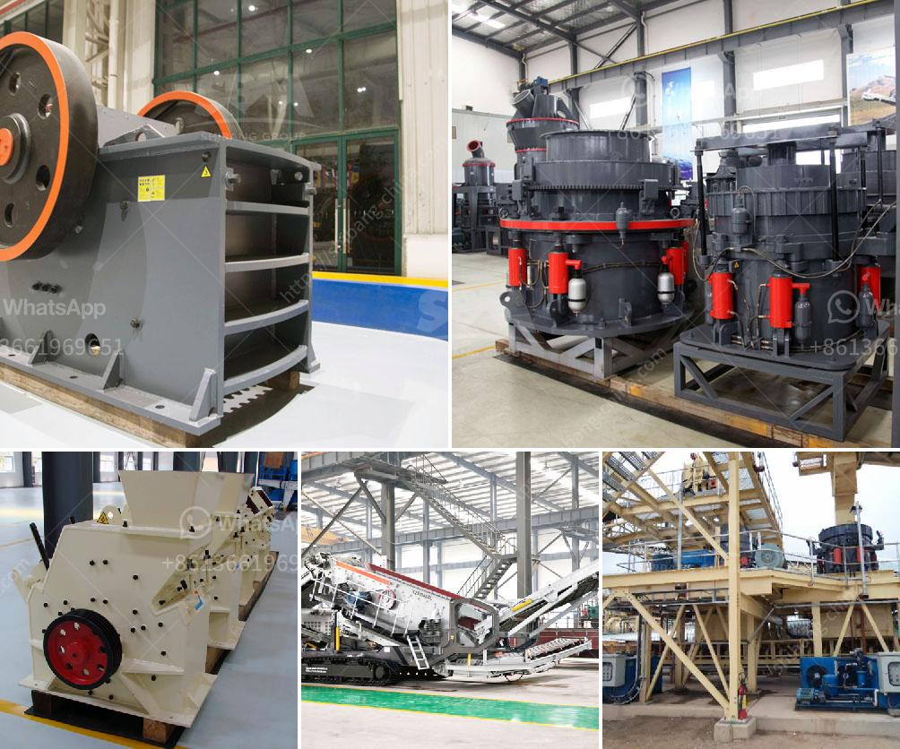

<h3>recycled concrete manufacturers in shanghai</h3>
Shanghai, renowned for its impressive skyline and rapidly expanding infrastructure, is also a city that is embracing sustainable practices in the construction industry. As the demand for new buildings and infrastructure projects continues to grow, so does the need for sustainable materials. This has led to the rise of recycled concrete manufacturers in Shanghai who are turning waste into valuable resources.

Recycled concrete, also known as crushed concrete aggregate (CCA), is produced by crushing concrete debris from demolition sites or unused concrete from construction sites. This process not only reduces the amount of waste sent to landfills but also helps to conserve natural resources by recycling materials that would have otherwise been discarded.

One of the key advantages of using recycled concrete is its positive environmental impact. Traditional methods of concrete production require large amounts of energy and water, and contribute to the depletion of natural resources. However, recycled concrete manufacturers in Shanghai are utilizing innovative technologies and processes to produce high-quality concrete from recycled materials.

By using recycled concrete in construction projects, Shanghai is not only reducing waste but also saving energy and lowering carbon emissions. According to industry experts, using recycled concrete can result in energy savings of up to 50% compared to traditional concrete production methods. This reduction in energy consumption directly translates into a significant decrease in greenhouse gas emissions, helping Shanghai move towards a more sustainable and greener future.

Furthermore, the use of recycled concrete also offers economic benefits. With a growing emphasis on sustainability in the construction industry, many companies and organizations are actively seeking environmentally friendly materials. This creates a market demand for recycled concrete, and manufacturers in Shanghai are seizing the opportunity to provide a sustainable solution.

In addition to being environmentally and economically beneficial, recycled concrete also possesses similar properties to traditional concrete. It can be used for various construction applications, including foundations, pavements, and building structures. The durability and strength of recycled concrete are comparable to that of conventional concrete, making it a viable option for construction projects of all sizes and complexities.

Fortunately, Shanghai is home to a number of reputable and innovative recycled concrete manufacturers. These companies have invested in state-of-the-art equipment and have developed advanced processes to ensure the production of high-quality recycled concrete. Additionally, they work closely with construction companies and engineers to provide tailored solutions that meet specific project requirements.

Moreover, these manufacturers also support research and development initiatives to further improve the performance and sustainability of recycled concrete. Through ongoing experiments and innovations, they aim to enhance the production process, reduce energy consumption, and develop new applications for recycled concrete in the construction industry.

In conclusion, the rise of recycled concrete manufacturers in Shanghai is a testament to the city's commitment to sustainable construction practices. By transforming waste into valuable resources, these manufacturers not only contribute to waste reduction and conservation of natural resources but also help create a greener and more environmentally friendly urban landscape. With their innovative approaches and dedication to sustainability, recycled concrete manufacturers are playing a crucial part in Shanghai's journey towards a more sustainable future.
<h3>Contact us</h3><ul><li><strong>Whatsapp:&nbsp;<a href="https://wa.me/8613661969651">+8613661969651</a></strong></li><li><a href="https://swt.shibang-china.com/?git&amp;zhl&amp;recycled concrete manufacturers in shanghai"><strong>Online Service(chat now)</strong></a></li></ul><h3>Related</h3><ul><li><a href='enquiry about impact crusher.md'>enquiry about impact crusher</a></li><li><a href='rock crusher unit.md'>rock crusher unit</a></li><li><a href='coal powder making.md'>coal powder making</a></li><li><a href='small ball mill for cement clinker grinding india.md'>small ball mill for cement clinker grinding india</a></li><li><a href='100tpd gold processing plant.md'>100tpd gold processing plant</a></li></ul>