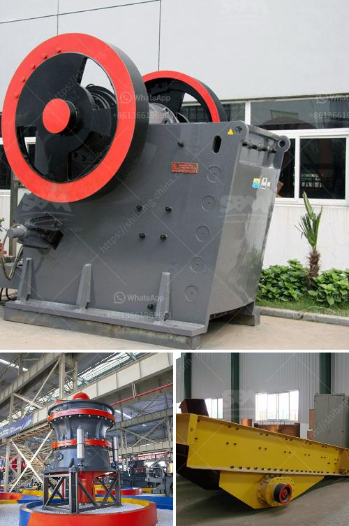

<h3>recycled crushed concrete 20mm</h3>
In recent years, there has been a growing focus on sustainability within the construction industry. As we strive to reduce our carbon footprint and minimize waste, finding innovative and environmentally friendly building materials has become imperative. One such material that is gaining popularity is recycled crushed concrete 20mm.

Recycled crushed concrete 20mm is a type of aggregate that is produced from old concrete structures. Instead of sending concrete waste to landfills, it is processed and crushed into smaller particles, ranging from 20mm to fine dust. This recycled material is then used in various construction applications, including road base, drainage fill, and the production of new concrete.

One of the key advantages of using recycled crushed concrete 20mm is its positive impact on the environment. By diverting concrete waste from landfills, this recycled material reduces the need for mining and extraction of raw materials, such as gravel and sand. Additionally, the production of new concrete from recycled crushed concrete requires less energy and emits fewer greenhouse gases compared to traditional concrete production methods. This makes it an excellent choice for architects, builders, and contractors who are committed to sustainable construction practices.

Furthermore, recycled crushed concrete 20mm offers several performance benefits. Its rough texture provides excellent grip and stability, making it ideal for creating strong foundations, road sub-bases, and pavements. Due to its angular shape, it interlocks well and doesn't deform easily, ensuring durability and longevity. Moreover, its versatility allows for a wide range of construction applications, making it a cost-effective alternative to traditional aggregate materials.

Apart from being environmentally friendly and versatile, recycled crushed concrete 20mm also helps to conserve natural resources. By reusing concrete waste, we can extend the lifespan of existing materials and reduce our reliance on virgin resources. Additionally, it contributes to the circular economy by closing the loop of materials, where waste becomes a valuable resource for further use.

In conclusion, recycled crushed concrete 20mm is an excellent choice for sustainable construction practices. Its positive environmental impact, performance benefits, and resource conservation make it a compelling option for builders and contractors. By opting for this recycled material, we are not only reducing waste and carbon emissions but also creating a more circular and resilient construction industry. As we continue to prioritize sustainability, recycled crushed concrete 20mm emerges as a valuable solution for a greener future.
<h3>Contact us</h3><ul><li><strong>Whatsapp:&nbsp;<a href="https://wa.me/8613661969651">+8613661969651</a></strong></li><li><a href="https://swt.shibang-china.com/?git&amp;zhl&amp;recycled crushed concrete 20mm"><strong>Online Service(chat now)</strong></a></li></ul><h3>Related</h3><ul><li><a href='vibrating screen size 1mm.md'>vibrating screen size 1mm</a></li><li><a href='chrome crusher machine price list.md'>chrome crusher machine price list</a></li><li><a href='benefits of vsi crusher.md'>benefits of vsi crusher</a></li><li><a href='hand powered rock crusher binq mining.md'>hand powered rock crusher binq mining</a></li><li><a href='portable conveyor belts for sale.md'>portable conveyor belts for sale</a></li></ul>