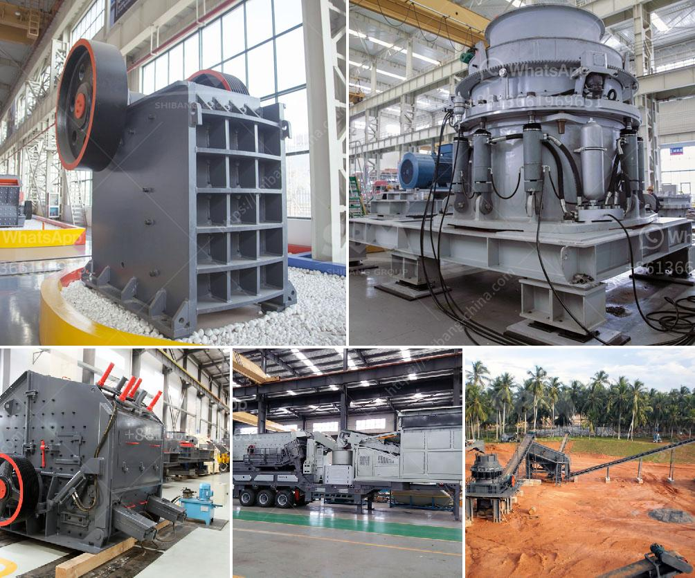

<h3>recycling of material in construction</h3>
The construction industry is one of the largest consumers of natural resources and generates a significant amount of waste. However, as the need for sustainable practices becomes increasingly urgent, the concept of recycling materials in construction has gained traction. Recycling construction materials not only reduces our carbon footprint but also conserves resources, saves costs, and promotes environmental responsibility.

One of the primary benefits of recycling in construction is the reduction of waste sent to landfills. Construction and demolition waste make up a significant portion of landfill content, which can pose environmental hazards and deplete valuable land resources. By recycling materials such as concrete, wood, steel, and asphalt, we can divert a substantial amount of waste from landfills, reducing the strain on these already limited spaces.

Concrete is a prime example of a recyclable material in construction. After demolition or renovation, concrete can be crushed and transformed into aggregate, a valuable resource that can replace newly mined gravel and sand. Recycling concrete not only saves landfill space but also decreases the need for extracting and processing new materials, ultimately conserving energy and reducing greenhouse gas emissions.

Similarly, wood waste from construction and demolition projects can be diverted from landfills and repurposed. Reclaimed wood can be used in construction projects and furniture manufacturing, reducing the demand for newly harvested timber and helping to preserve forests. Moreover, reusing wood products, such as beams and flooring, not only reduces waste but also adds a unique character to the final product, giving it a sense of history and sustainability.

Steel is another vital material in construction that can be recycled effectively. During demolition, steel beams, reinforcement bars, and other structural elements can be recovered and recycled, reducing the need for virgin steel production. Recycling steel not only conserves natural resources but also saves energy and reduces greenhouse gas emissions by up to 70%.

Asphalt is commonly used for road construction and maintenance. When asphalt pavement reaches the end of its useful life, it can be recycled by grinding it down into small pieces and mixing it with new asphalt binder. This process, known as asphalt pavement recycling, conserves aggregate resources and also reduces the energy required for manufacturing fresh asphalt. Additionally, the recycled asphalt mix often exhibits improved performance and durability compared to traditional road pavement materials.

In addition to these primary materials, recycling in construction extends to other components as well. Plastics, glass, and even carpeting can be recycled and used in various construction applications. By incorporating recycled materials into new construction projects, builders can effectively contribute to resource conservation and waste reduction.

To fully embrace recycling in construction, it is crucial to establish proper waste management systems on construction sites. Implementing segregating processes for various materials and providing designated collection points can facilitate easier recycling. Additionally, raising awareness among construction professionals, workers, and clients about the benefits of recycling materials can drive the adoption of sustainable practices within the industry.

In conclusion, recycling materials in construction is a vital step towards achieving sustainable development and reducing our impact on the environment. By diverting waste from landfills and reusing materials, we can conserve resources, save costs, and promote environmental responsibility. The adoption of recycling practices in construction not only benefits the industry but also contributes to a greener future for generations to come.
<h3>Contact us</h3><ul><li><strong>Whatsapp:&nbsp;<a href="https://wa.me/8613661969651">+8613661969651</a></strong></li><li><a href="https://swt.shibang-china.com/?git&amp;zhl&amp;recycling of material in construction"><strong>Online Service(chat now)</strong></a></li></ul><h3>Related</h3><ul><li><a href='industrial conveyor belts dimensions.md'>industrial conveyor belts dimensions</a></li><li><a href='gold mining production line or gold mining plant.md'>gold mining production line or gold mining plant</a></li><li><a href='price of industrial hammer mill.md'>price of industrial hammer mill</a></li><li><a href='manufacturers crushing stone.md'>manufacturers crushing stone</a></li><li><a href='gypsum board plant in richmond hill.md'>gypsum board plant in richmond hill</a></li></ul>