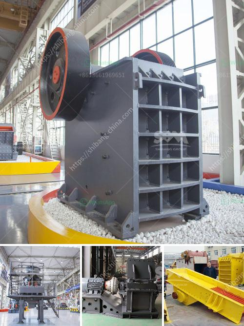

<h3>rencana anggaran biaya stone crusher</h3>
Rencana anggaran biaya (RAB) merupakan suatu dokumen penting dalam perencanaan sebuah proyek konstruksi. RAB berperan sebagai panduan bagi pelaksanaan proyek, termasuk pengadaan material dan penggunaan tenaga kerja. Salah satu jenis proyek konstruksi yang membutuhkan RAB adalah proyek stone crusher.

Stone crusher adalah mesin yang digunakan untuk menghancurkan batuan besar menjadi batuan kecil atau macam-macam ukuran batuan sesuai dengan kebutuhan proyek konstruksi. Stone crusher biasa digunakan untuk memproduksi split untuk proyek konstruksi seperti jalan, gedung, rumah, dan proyek lainnya. Oleh karena itu, penggunaan stone crusher pada proyek konstruksi tentunya membutuhkan rencana anggaran biaya yang matang.

Dalam membuat RAB untuk stone crusher, terdapat beberapa hal yang perlu diperhatikan. Pertama-tama, perlu diketahui jenis stone crusher yang akan digunakan. Ada beberapa jenis stone crusher yang umum digunakan, antara lain jaw crusher, cone crusher, impact crusher, dan gyratory crusher. Setiap jenis stone crusher memiliki harga dan karakteristik yang berbeda, sehingga perlu dipertimbangkan dengan matang agar sesuai dengan kebutuhan proyek.

Selanjutnya, dalam merencanakan anggaran biaya untuk stone crusher, perlu dipertimbangkan biaya-biaya yang terkait dengan pemeliharaan dan perawatan mesin. Stone crusher merupakan mesin yang bekerja dengan kapasitas besar dan intensitas tinggi, sehingga perlu dilakukan pemeliharaan dan perawatan rutin agar mesin dapat berfungsi secara optimal. Biaya perawatan dan pemeliharaan ini perlu dimasukkan ke dalam RAB, agar proyek tidak terhambat akibat kerusakan atau masalah pada mesin.

Selain itu, dalam RAB stone crusher, perlu dipertimbangkan juga biaya transportasi material. Stone crusher tidak hanya digunakan untuk menghancurkan batuan, tetapi juga membutuhkan batuan yang dihancurkan sebagai bahan baku. Batuan yang dihancurkan biasanya harus diangkut dari tambang atau lokasi lain ke tempat proyek. Oleh karena itu, biaya transportasi material perlu dicermati agar tidak menimbulkan tambahan biaya yang tidak perlu.

Terakhir, dalam menyusun RAB stone crusher, perlu adanya pos pengeluaran yang mencakup biaya-biaya lainnya seperti biaya listrik, biaya air, dan biaya bahan bakar. Stone crusher adalah mesin yang membutuhkan energi untuk beroperasi, sehingga perlu dihitung dan dipasukkan ke dalam RAB agar tidak terjadi kekurangan dana di tengah proyek.

Dalam proyek konstruksi manapun, termasuk penggunaan stone crusher, rencana anggaran biaya adalah salah satu faktor kunci untuk kesuksesan proyek. Dengan melakukan perencanaan anggaran yang matang dan cermat, proyek stone crusher dapat berjalan dengan efisien dan terhindar dari masalah keuangan di tengah proyek. Oleh karena itu, para pelaksana proyek harus meluangkan waktu dan tenaga untuk menyusun RAB stone crusher dengan seksama.
<h3>Contact us</h3><ul><li><strong>Whatsapp:&nbsp;<a href="https://wa.me/8613661969651">+8613661969651</a></strong></li><li><a href="https://swt.shibang-china.com/?git&amp;zhl&amp;rencana anggaran biaya stone crusher"><strong>Online Service(chat now)</strong></a></li></ul><h3>Related</h3><ul><li><a href='crush plant prices in pakistan.md'>crush plant prices in pakistan</a></li><li><a href='crusher plant equipment.md'>crusher plant equipment</a></li><li><a href='price of ball mill in india.md'>price of ball mill in india</a></li><li><a href='mobile crusher price algerie.md'>mobile crusher price algerie</a></li><li><a href='cobble crusher supplier.md'>cobble crusher supplier</a></li></ul>