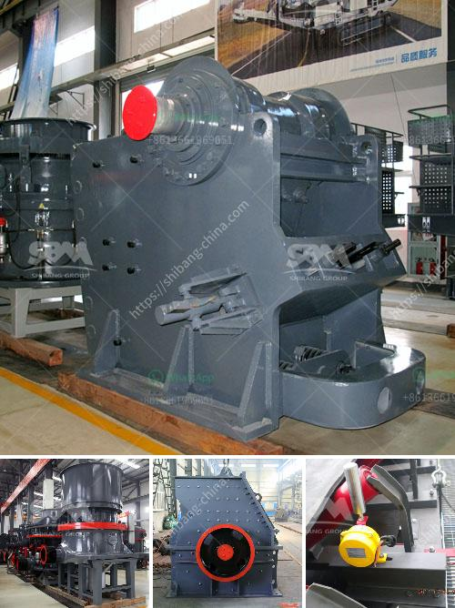

<h3>rencana bisnis perusahaan tambang pdf</h3>
A business plan is a crucial document that outlines the goals and strategies of a company. For a mining company, a well-crafted business plan is essential to demonstrate the potential profitability and sustainability of the operation. This article will discuss the importance of a business plan for a mining company and the benefits of using a PDF format for the presentation.

A mining company's business plan serves several purposes. Firstly, it helps the management team set clear objectives and define the steps required to achieve them. By outlining the company's financial projections, marketing strategies, and operational plans, the business plan acts as a roadmap for the company's success. Additionally, it serves as a communication tool to attract potential investors or secure financing from financial institutions.

When choosing the format for presenting the business plan, using a PDF (Portable Document Format) offers several benefits. First and foremost, PDFs ensure that the document's layout and formatting remain consistent across various devices and operating systems. This is especially crucial when sharing the business plan with potential investors or other stakeholders who may be viewing the document on different platforms.

Furthermore, PDFs allow for secure sharing of information. Companies can protect sensitive data by encrypting the PDF document with a password, restricting editing or printing capabilities, and adding watermarks to the pages. This ensures that confidential information remains confidential and that the document does not undergo unauthorized changes.

Another advantage of using a PDF is the ability to hyperlink content within the document. This feature allows mining companies to include relevant links to additional information such as market research reports, geological survey data, or regulatory requirements. Hyperlinks enhance the business plan's clarity and credibility by providing easy access to supporting documentation or external references.

Lastly, PDFs are easily shareable and can be distributed electronically or printed as hard copies. This flexibility allows mining companies to reach a wider audience and showcase their business plan to potential investors, government authorities, or other stakeholders.

In conclusion, a well-crafted business plan is crucial for the success of a mining company. Choosing the PDF format for presenting the business plan offers numerous benefits, including consistent formatting, secure sharing of information, hyperlinking capabilities, and easy distribution. By utilizing all these advantages, mining companies can effectively communicate their goals, strategies, and potential profitability to attract investments and achieve long-term sustainability.
<h3>Contact us</h3><ul><li><strong>Whatsapp:&nbsp;<a href="https://wa.me/8613661969651">+8613661969651</a></strong></li><li><a href="https://swt.shibang-china.com/?git&amp;zhl&amp;rencana bisnis perusahaan tambang pdf"><strong>Online Service(chat now)</strong></a></li></ul><h3>Related</h3><ul><li><a href='contact list of stone crusher companies in south africa.md'>contact list of stone crusher companies in south africa</a></li><li><a href='impact crusher suppliers italy.md'>impact crusher suppliers italy</a></li><li><a href='germany made grinding mill.md'>germany made grinding mill</a></li><li><a href='models of ball mills.md'>models of ball mills</a></li><li><a href='speed of vibrating screen.md'>speed of vibrating screen</a></li></ul>