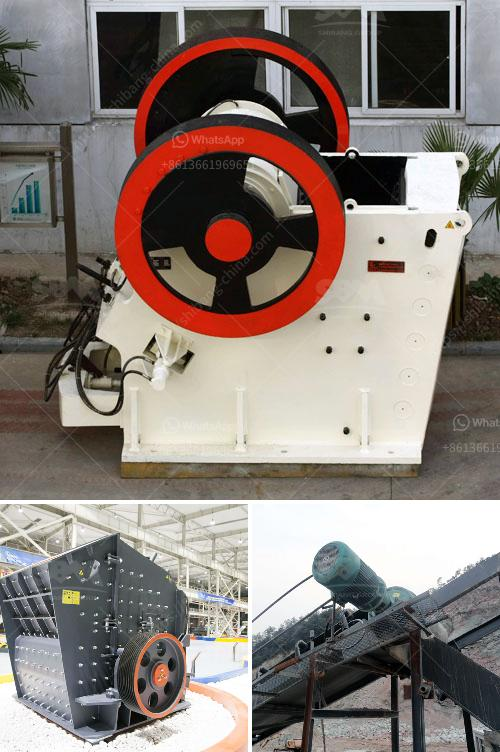

<h3>rent a conveyor belt</h3>
In today's fast-paced industrial world, efficiency and productivity can make all the difference in the success of a business. Whether it's in the construction, mining, or manufacturing industries, companies are constantly seeking innovative ways to streamline their operations. One such solution that has gained significant popularity over the years is renting a conveyor belt. Offering a cost-effective and flexible alternative to purchasing, renting a conveyor belt has become an invaluable asset for various industries.

Conveyor belts are fundamental components of numerous industrial processes, facilitating the transportation of materials and products from one point to another. These systems consist of a continuous loop of belts that are powered by pulleys, allowing them to move materials effortlessly. With the ability to handle heavy loads and operate over long distances, conveyor belts have revolutionized the way industries function.

One of the primary advantages of renting a conveyor belt is the cost-saving benefits it offers. Purchasing a conveyor belt can be a significant upfront investment, especially for smaller businesses or those with fluctuating demand. Renting, on the other hand, allows businesses to access the equipment they need without incurring high capital costs. Additionally, renting eliminates the need for ongoing maintenance and repairs, as these responsibilities typically fall on the owner of the equipment.

Furthermore, renting a conveyor belt provides businesses with a flexible solution that can be tailored to their specific needs. Whether it's a short-term project or a temporary increase in production, industrial rental companies offer various rental periods to accommodate different requirements. This flexibility ensures that businesses only pay for the equipment when they actually need it, avoiding unnecessary expenses and optimizing resource allocation.

Renting a conveyor belt also offers the advantage of trying out different options and configurations before committing to a purchase. With advancements in technology, conveyor belts now come in various sizes, types, and designs to suit different applications. By renting different models, businesses can assess their efficiency, reliability, and compatibility with their operations to find the most suitable solution before making a long-term investment.

Additionally, rental companies offer comprehensive maintenance and support services, ensuring that the conveyor belt operates at optimal levels throughout the rental period. This allows businesses to focus on their core operations without worrying about equipment breakdowns or malfunctioning. On-site assistance and quick access to spare parts further minimize downtime and maximize overall productivity.

Renting a conveyor belt is also an environmentally-friendly choice. With a focus on sustainability and reducing carbon footprints, many businesses are actively seeking ways to minimize waste and enhance efficiency. Choosing to rent a conveyor belt reduces the need for extraction and manufacturing of new equipment, contributing to the conservation of natural resources. It also reduces the amount of waste generated from disposing of outdated or obsolete machinery.

In conclusion, renting a conveyor belt has become an attractive option for businesses across various industries. From cost savings and flexibility to reducing environmental impact, rental solutions provide a multitude of benefits. By eliminating the need for capital investment and offering comprehensive maintenance and support services, industrial rental companies have become invaluable partners in enhancing operational efficiency. For businesses looking to optimize their operations and stay ahead in the competitive market, renting a conveyor belt is a smart choice.
<h3>Contact us</h3><ul><li><strong>Whatsapp:&nbsp;<a href="https://wa.me/8613661969651">+8613661969651</a></strong></li><li><a href="https://swt.shibang-china.com/?git&amp;zhl&amp;rent a conveyor belt"><strong>Online Service(chat now)</strong></a></li></ul><h3>Related</h3><ul><li><a href='mobile stone crusher machine price.md'>mobile stone crusher machine price</a></li><li><a href='crushing equipment manufacturers.md'>crushing equipment manufacturers</a></li><li><a href='mobile rock crushing plant nigeria.md'>mobile rock crushing plant nigeria</a></li><li><a href='two roll mill roller price.md'>two roll mill roller price</a></li><li><a href='quarry machines from germany.md'>quarry machines from germany</a></li></ul>