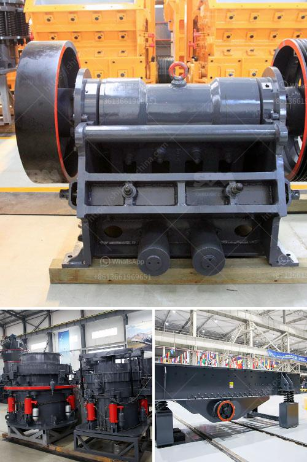

<h3>river sand mining machine for sale</h3>
The mentioned article talks about a common type of mining machine used in the rivers across the globe. River sand mining machine is essential for a construction project. It is widely used in the mining industry, as it is a prolonged and labor-intensive process that requires focused attention.

River sand is extracted from the riverbed, stream, and floodplain using heavy machinery. The process involves dredging, scooping, or suctioning the sand from these areas. The sand is then transported to a processing plant to remove impurities, such as clay, silt, and organic matter, before being sold for various construction applications.

The river sand mining machine is designed with advanced technology and high-quality materials. It can effectively extract sand from the riverbed with minimal environmental impact. The machine is equipped with a powerful suction pump that creates a vacuum to lift the sand from the riverbed. It is also equipped with a sediment separation system, which separates the sand from water and other impurities.

One of the key advantages of using a river sand mining machine is that it increases the efficiency of the sand extraction process. The machine can operate round the clock, extracting a large quantity of sand in a short amount of time. This makes it ideal for construction projects that have a high sand demand. By using the machine, contractors can save time and reduce labor costs.

Furthermore, the river sand mining machine is designed to minimize environmental impact. It is equipped with a sediment separation system that separates the sand from water and other impurities. This reduces the amount of sediment discharged back into the river, preventing water pollution. Moreover, the machine is designed to minimize noise and vibration, reducing disturbance to aquatic life.

In recent years, the demand for river sand has been growing due to the rapid urbanization and infrastructure development. However, the increasing demand has led to excessive sand mining, which can cause environmental damage and riverbed erosion. To address these concerns, the river sand mining machine is designed with sustainability in mind. It is equipped with sensors and monitoring systems to ensure that the sand extraction is done within sustainable limits.

In conclusion, the river sand mining machine is an essential tool for extracting sand from rivers for construction projects. It is designed with advanced technology and high-quality materials to ensure efficient sand extraction with minimal environmental impact. The machine's ability to operate round the clock and its sustainability features make it an ideal choice for contractors. By using this machine, construction projects can meet their sand demand while minimizing environmental damage.
<h3>Contact us</h3><ul><li><strong>Whatsapp:&nbsp;<a href="https://wa.me/8613661969651">+8613661969651</a></strong></li><li><a href="https://swt.shibang-china.com/?git&amp;zhl&amp;river sand mining machine for sale"><strong>Online Service(chat now)</strong></a></li></ul><h3>Related</h3><ul><li><a href='aggregate equipment for sale.md'>aggregate equipment for sale</a></li><li><a href='cost o gypsum processing machines.md'>cost o gypsum processing machines</a></li><li><a href='river stone crusher for sale.md'>river stone crusher for sale</a></li><li><a href='crusher plant equipment.md'>crusher plant equipment</a></li><li><a href='sand washing process.md'>sand washing process</a></li></ul>