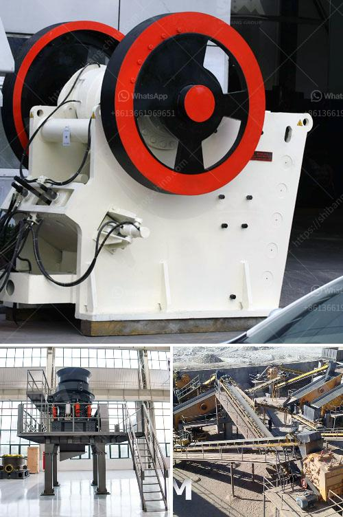

<h3>river stone crusher for sale</h3>
Since the development of human civilization, river stones have been widely used as building materials. However, due to the rocks' hardness, durability, and smooth shape, it is difficult for them to be utilized for practical purposes. Fortunately, the invention of the river stone crusher has saved the situation. Aimix Group, a professional crusher manufacturer, has developed and manufactured various types of crusher machines for river stones conveniently.

The river stone crusher machine has a unique design and new performance, which makes it popular in the crushing industry. This product is closely linked to the development of the mining market, and it expands the range of crushing possibilities. Hence, the market demand for it is continuously growing. Aimix Group's river stone crusher can process materials ranging from 150-1800mm, and its capacities can reach 80-1000t/h.

The reason why it is opted by customers is due to its excellent performance. The optimized design of the crushing cavity, heavy-duty rotor, high wear-resistant hammer head, and hydraulic opening device ensure that it has the ability to crush the hard materials with high efficiency. It can break river stones into various granule sizes, such as 0-5mm, 5-10mm, 10-20mm, and even larger. Moreover, it can produce different kinds of finished stones from river pebbles, including artificial sand used for construction, concrete aggregates, and road construction materials.

Additionally, the river stone crusher is easy to maintain and operate. It requires low maintenance and is easy to clean due to its simple structure. The unique design of the discharge opening can ensure the smooth flow of materials, making the process highly efficient. Hence, it significantly reduces the labor and time required for maintenance and operation.

Furthermore, the river stone crusher for sale has a reasonable price. All of our machines are branded and manufactured with high-quality materials. The product design is under rigorous quality control. Every unit is tested before being delivered to customers, ensuring excellent performance, durability, and a long service life. Aimix Group provides a warranty and after-sales service, which gives customers peace of mind.

The river stone crusher manufactured by Aimix Group is widely used in various industrial sectors such as crushing production line, sand making production line, mining, and other industries. It does the operation in the industry accelerated by the rapid economic development in China. If you are looking for a reliable river stone crusher for sale, choose Aimix Group as your supplier. Since its establishment, Aimix has strived to provide efficient and high-quality products to customers worldwide.

In conclusion, the river stone crusher for sale from Aimix Group is a good choice, reducing unnecessary waste of limited resources, improving work efficiency, and maximizing the value of resources. If you want to buy a river stone crusher, welcome to visit Aimix's website for more detailed information.
<h3>Contact us</h3><ul><li><strong>Whatsapp:&nbsp;<a href="https://wa.me/8613661969651">+8613661969651</a></strong></li><li><a href="https://swt.shibang-china.com/?git&amp;zhl&amp;river stone crusher for sale"><strong>Online Service(chat now)</strong></a></li></ul><h3>Related</h3><ul><li><a href='barite mill specifications.md'>barite mill specifications</a></li><li><a href='fly ash grinding machine manufacturer.md'>fly ash grinding machine manufacturer</a></li><li><a href='best china brand crushing plant.md'>best china brand crushing plant</a></li><li><a href='ball mill in wait of ball.md'>ball mill in wait of ball</a></li><li><a href='roller mill machine for mining.md'>roller mill machine for mining</a></li></ul>