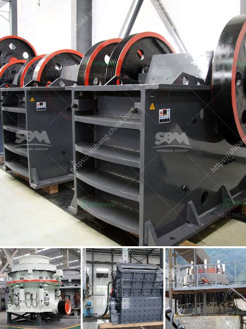

<h3>rock crusher and screens philippines</h3>
The Philippines, hands down, is richly blessed with mineral resources. Anything from gold, silver to zinc, copper and even valuable non-metallic minerals like marble, limestone and quartz. During the country’s long history of mining, there is one product that stayed true to its promise amidst the wreckage of the failed mining industry. This is the hegemony of the Rock Crusher and Screens.

Undeniably, once rock-crushing plants have started operating, their effects and repercussions became unbearable—coughing miners covered in dust, spirits brought down by the grueling noise levels, and claustrophobic workspaces. They also had to deal with the hidden dangers and risks such as collapsing tunnels and respiratory illnesses. However, today’s generation of rock crushers and screens has proved to be more cost-effective and efficient in delivering the gold that everyone dreams about.

Rock crushers and screens usually accompany a mining company to extract or process a variety of minerals. Gold is perhaps the most famous element and the most sought-after in the world. But how can one extract or refine gold from rock ore? Experts record that the process begins by crushing the rocks (ore) into small manageable chunks. The process undergoes these stages: pre-crushing, screening, crushing, fine grinding, and filtration. The gold concentrate is collected as dust or pulp and is further refined using various procedures like electrolysis.

Crushing and screening quartz pays the stars. The process begins by crushing the quartz crystals, and then the pulp is grabbed and swirled around with water in a rotating drum. Afterwards, the particles are then precisely separated depending on the size by using screens with different mesh. This whole process, though, is completely dependent on just one piece of equipment — the rock crusher and screens.

In the Philippines, the most well-known form of machinery used in mining is the rock crusher and screens. It is versatile and can be used in a variety of mining industries and processes. Compact in size, this crusher is capable of crushing a wide range of materials to meet your various needs. Whether you need it for primary crushing or secondary crushing, you can rely on its capabilities for high productivity.

Moreover, the rock crusher and screens have served as worthy contributors towards the construction industry as well. Several kinds of raw materials like rocks, ores and recycling concrete can all be taken care of by smartly designed crushers and screens.

Finally, the most evident acknowledgment of the rock crusher and screens’ existence is that you can find their imprints everywhere. They worked wonders in the Ore Extraction Facilities in Paracale, Camarines Norte. They stood firmly in the gold-rich valleys of Gumaus, Pulang Lupa, Tawig and Paraoir in Itogon, Benguet. They left their legacy in the infamous mountain graveyards of Cebu and Marinduque. And the revolution of rock crushers and screens has extended to every nook and cranny of the country.

While showbiz personalities vie with adrenaline, miners work hard deep into the dark bowels of the earth—armed with their trusted rock crushers and screens—to bring fortuitous dreams of gold and prosperity to life. In the heart of every miner, there lies a realization that their tools are an essential part of their journey towards striking gold. The rock crusher and screens Philippines have made this task easier for them, allowing businesses and other entities to increase production and productivity.

In conclusion, the rock crusher and screens Philippines are saying goodbye to the traditional crude methods of extracting gold options that they have been using for decades. A revolution is unfolding before our very eyes, bringing forth the tools we have been praying for. With the help of this out-and-out technological breakthrough, the Philippines can claim its rightful spot in the international mining industry. It is a leap forward to a better and brighter future.
<h3>Contact us</h3><ul><li><strong>Whatsapp:&nbsp;<a href="https://wa.me/8613661969651">+8613661969651</a></strong></li><li><a href="https://swt.shibang-china.com/?git&amp;zhl&amp;rock crusher and screens philippines"><strong>Online Service(chat now)</strong></a></li></ul><h3>Related</h3><ul><li><a href='concrete crusher for rent michigan.md'>concrete crusher for rent michigan</a></li><li><a href='process of setting of a stone crusher in orissa.md'>process of setting of a stone crusher in orissa</a></li><li><a href='jaw crusher for sale ton per hour.md'>jaw crusher for sale ton per hour</a></li><li><a href='portable gold mining plant pdf.md'>portable gold mining plant pdf</a></li><li><a href='mobile crusher price algerie.md'>mobile crusher price algerie</a></li></ul>