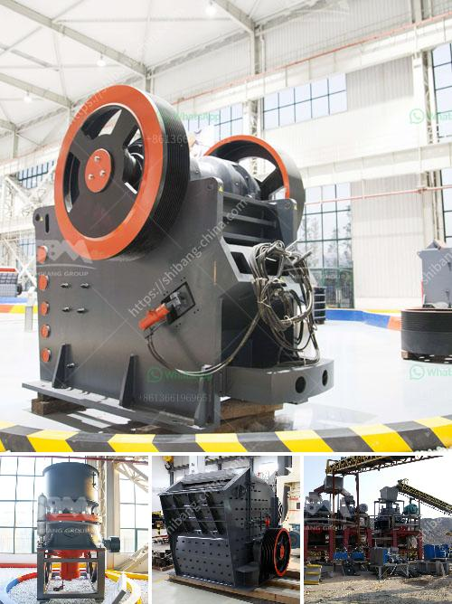

<h3>rock crusher gravel machine south africa</h3>
Rock crusher gravel machine south Africa is a machine designed to reduce large rocks into smaller rocks, gravel, or rock dust. It is an important tool in the mining and construction industry. The purpose of the machine is to move and crush rocks into smaller aggregates of gravel and sand. The materials used in the process are usually obtained from the earth's surface through the process of mining.

The rock crusher gravel machine south Africa is specifically designed to produce crushed stone for road and construction purposes. While also producing sand for the concrete and asphalt industry. This machine has a simple structure, which makes it lightweight and easy to operate. It is durable and can withstand harsh conditions, making it suitable for use in various mining and construction sites.

One of the main advantages of the rock crusher gravel machine south Africa is its versatility. It can be used for various applications, including crushing rocks, gravel, or sand. This makes it a useful tool for different industries, such as mining, construction, and road building. It can also be used in the recycling industry to crush concrete, asphalt, and other materials.

In addition, the machine is highly efficient and can crush rocks and gravel quickly and effectively. It can process large volumes of materials, making it ideal for large-scale projects. Furthermore, the machine produces consistent and uniform aggregates, ensuring high-quality end products.

The rock crusher gravel machine south Africa is also easy to maintain and operate, making it cost-effective and efficient in the long run. It requires minimal manual labor and can be operated remotely, reducing the risk of accidents and injuries. Additionally, it has low energy consumption, saving on energy costs.

In conclusion, the rock crusher gravel machine south Africa is a valuable tool in the mining and construction industry. It is efficient, versatile, and easy to use, making it an essential machine for any mining or construction project. With its high-quality end products, durability, and cost-effectiveness, it is an investment worth considering.
<h3>Contact us</h3><ul><li><strong>Whatsapp:&nbsp;<a href="https://wa.me/8613661969651">+8613661969651</a></strong></li><li><a href="https://swt.shibang-china.com/?git&amp;zhl&amp;rock crusher gravel machine south africa"><strong>Online Service(chat now)</strong></a></li></ul><h3>Related</h3><ul><li><a href='coal processing plant.md'>coal processing plant</a></li><li><a href='chromite ore flowsheet pdf.md'>chromite ore flowsheet pdf</a></li><li><a href='standard operating procedure for coal pulverizer.md'>standard operating procedure for coal pulverizer</a></li><li><a href='magnesite processing plant.md'>magnesite processing plant</a></li><li><a href='small ball mill price.md'>small ball mill price</a></li></ul>