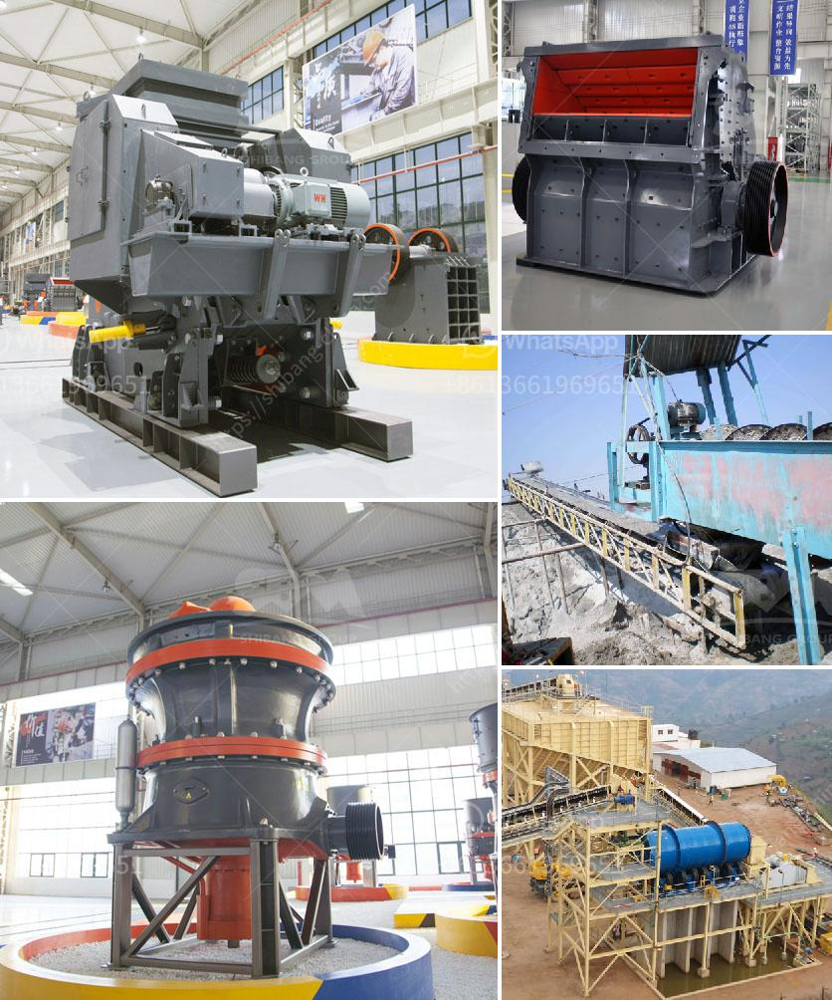

<h3>rock crusher in philippines</h3>
In Philippines, explosives or excavating are used to remove rock from the earth for crushing. Rock can also be natural, gravel or construction waste. Rock is crushed in two or three different phases: primary, secondary and tertiary crushing. The crushing process often involves one or more phases of screening to classify the different particle size. Crushing equipment is available in different models, including stationary and portable crushers.

People often have a misconception about the rock crusher, particularly regarding its efficiency and effectiveness. In reality, rock crushers are designed to break down large rocks into smaller, more manageable sizes, making them suitable for a variety of applications including road building, concrete production, and asphalt production. Furthermore, rock crushers can be employed for recycling construction materials and even granite or basalt can be processed and converted into aggregate materials.

The rock crushing process begins with a primary crusher that breaks down large rocks into smaller and more manageable pieces. This is followed by secondary crushing where the material is reduced in size to the desired specifications. Finally, the tertiary stage provides further reduction of the material for specific purposes such as asphalt production or concrete mix production. Each stage of the rock crushing process requires specific equipment to ensure that the desired outcome is achieved efficiently.

Modern rock crushers are highly efficient, with hydraulic systems that regulate the feed rate and control the size and shape of the final product. These machines are equipped with advanced technology, such as automatic overload protection and remote control, making them safer and easier to operate. The versatility of rock crushers allows them to be used in various applications, making them essential equipment in the construction industry.

In the Philippines, rock crushers are frequently used in permanent construction sites and large infrastructure projects. With the rapid development of infrastructure and urbanization in the country, the demand for rock crushers is steadily increasing. Aside from providing aggregate materials, rock crushers also contribute to reducing construction waste and promoting environmental sustainability.

One of the leading rock crusher manufacturers in the Philippines is Aimix Machinery. This company focuses on providing high-quality crushing equipment for different industries. They research and develop new products, catering to the specific needs of their customers. Aimix Machinery offers a wide range of rock crushers, including jaw crushers, impact crushers, cone crushers, and hammer crushers, as well as complete crushing and screening plants.

In conclusion, rock crushers are critical equipment in construction projects for breaking down large rocks into smaller, more manageable sizes. Whether it is for road building, concrete production, or recycling construction materials, rock crushers play a vital role in improving efficiency and productivity. Aimix Machinery, one of the leading rock crusher manufacturers in the Philippines, offers a wide range of crushing equipment designed to meet the specific needs of different industries.
<h3>Contact us</h3><ul><li><strong>Whatsapp:&nbsp;<a href="https://wa.me/8613661969651">+8613661969651</a></strong></li><li><a href="https://swt.shibang-china.com/?git&amp;zhl&amp;rock crusher in philippines"><strong>Online Service(chat now)</strong></a></li></ul><h3>Related</h3><ul><li><a href='mobile gold crusher plant.md'>mobile gold crusher plant</a></li><li><a href='material of sectional conveyor belts.md'>material of sectional conveyor belts</a></li><li><a href='coal wash plants for sale in malaysia.md'>coal wash plants for sale in malaysia</a></li><li><a href='price of gypsum processing plant.md'>price of gypsum processing plant</a></li><li><a href='grinding mill prices in south africa.md'>grinding mill prices in south africa</a></li></ul>