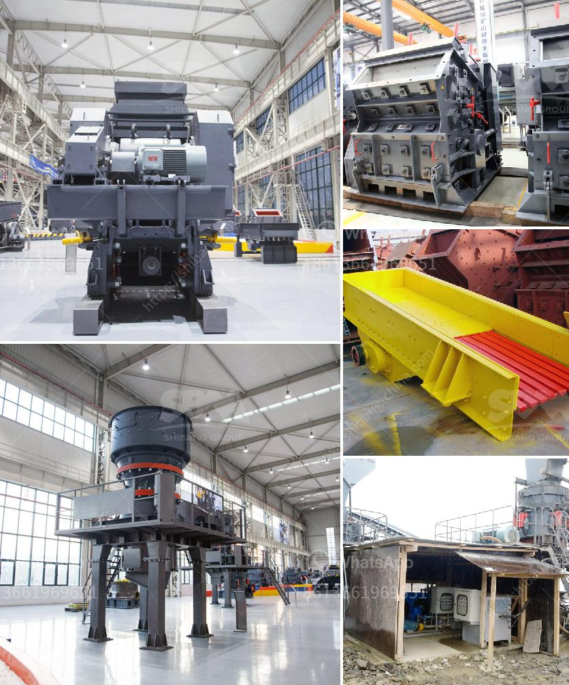

<h3>rock crusher machine for sale</h3>
Rock crushers are used in a wide range of industries, from mining and construction to recycling and demolition. They are designed to reduce the size of large rocks into smaller rocks, gravel, or rock dust. With the increasing demand for rock crusher machines, more and more manufacturers are launching high-performance machines for sale.

The rock crusher machine is an essential piece of equipment in many mining operations, as it can break down large and hard materials efficiently and reliably. Some of the advantages of rock crushers include low cost to operate, less downtime, and ease of maintenance. However, rock crushing machines require the user to be aware of potential hazards and follow all safety guidelines.

When looking to purchase a rock crusher machine, it is important to consider various factors. Firstly, one should determine the type and size of the material they need to crush. Different machines are designed to handle different types of materials, such as limestone, granite, or basalt. Additionally, the desired output size and production capacity should also be considered.

There are several types of rock crushers available on the market, including jaw crushers, cone crushers, impact crushers, and roll crushers. Each type has its own unique features and advantages. For example, jaw crushers are mainly used for primary crushing, while cone crushers are commonly used for secondary or tertiary crushing. Impact crushers provide excellent versatility and can handle various materials.

When purchasing a rock crusher machine for sale, it is vital to ensure that the machine has all the necessary features for efficient operation. Some essential features to look for include a powerful motor, adjustable settings for different output sizes, and easy maintenance access. Additionally, it is important to consider the reputation of the manufacturer and read customer reviews to ensure the machine's reliability and performance.

In conclusion, a rock crusher machine is a vital piece of equipment in any mining or construction project. It reduces the size of larger rocks into smaller rocks, gravel, or rock dust efficiently and effectively. When purchasing a rock crusher machine, one must consider the type and size of the material they wish to crush, along with the desired output size and production capacity. With the range of options available on the market, finding a suitable rock crusher machine for sale should be a straightforward process.
<h3>Contact us</h3><ul><li><strong>Whatsapp:&nbsp;<a href="https://wa.me/8613661969651">+8613661969651</a></strong></li><li><a href="https://swt.shibang-china.com/?git&amp;zhl&amp;rock crusher machine for sale"><strong>Online Service(chat now)</strong></a></li></ul><h3>Related</h3><ul><li><a href='rotary kilns in indonesia.md'>rotary kilns in indonesia</a></li><li><a href='manufacturing of talcum powder.md'>manufacturing of talcum powder</a></li><li><a href='crawler mobile crushers.md'>crawler mobile crushers</a></li><li><a href='type of crushers.md'>type of crushers</a></li><li><a href='portable sand washing machine.md'>portable sand washing machine</a></li></ul>