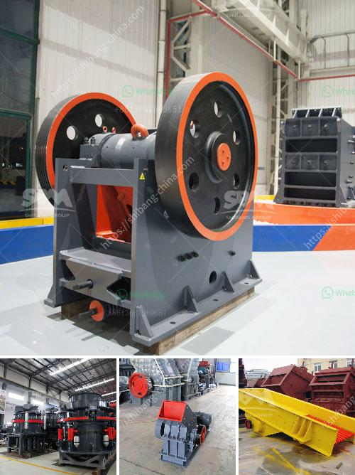

<h3>rock crusher screen</h3>
A rock crusher screen is a device used for filtering rocks from soil and other materials. There are many types of rock crusher screens available on the market, varying in size, shape, and mesh size. These screens have the ability to quickly and efficiently separate rocks and other debris, keeping the final product clean and free of unwanted materials.

One commonly used type of rock crusher screen is the inclined vibrating screen. These are typically used for smaller rocks and can be placed on top of a screening machine where the rocks pass through the screen. However, for larger rocks, such as boulders, a different type of screen is needed. This is where the grizzly screen comes into play.

A grizzly screen is essentially a large, heavy-duty screen that is placed before the rock crusher, enabling the rocks to be sorted into various sizes. The screen also prevents large rocks from bypassing the crusher and going directly to the conveyor belt. This helps to prevent damage to the crusher and ensures that only the desired size of rock is processed.

Rock crusher screens are made with durable materials, such as stainless steel and are highly resistant to wear and tear. They are designed to withstand heavy usage and can handle various types of rocks and materials, including abrasive, dirty, wet, and sticky materials. Some screens are designed for specific applications and can be customized to fit the needs of the user.

In conclusion, a rock crusher screen can significantly improve the efficiency of your crushing operation. It allows for the separation of rocks and other materials, ensuring that only the desired size is processed. With a variety of types and options available, there is a rock crusher screen for every application. Whether you are in the mining, construction, or recycling industry, a rock crusher screen can help optimize your operation and deliver high-quality end products.
<h3>Contact us</h3><ul><li><strong>Whatsapp:&nbsp;<a href="https://wa.me/8613661969651">+8613661969651</a></strong></li><li><a href="https://swt.shibang-china.com/?git&amp;zhl&amp;rock crusher screen"><strong>Online Service(chat now)</strong></a></li></ul><h3>Related</h3><ul><li><a href='europe stone quarry equipment supplier.md'>europe stone quarry equipment supplier</a></li><li><a href='roller mill compontes.md'>roller mill compontes</a></li><li><a href='granite grinding mill.md'>granite grinding mill</a></li><li><a href='stone crushing equipment south africa.md'>stone crushing equipment south africa</a></li><li><a href='limestone powder making process.md'>limestone powder making process</a></li></ul>