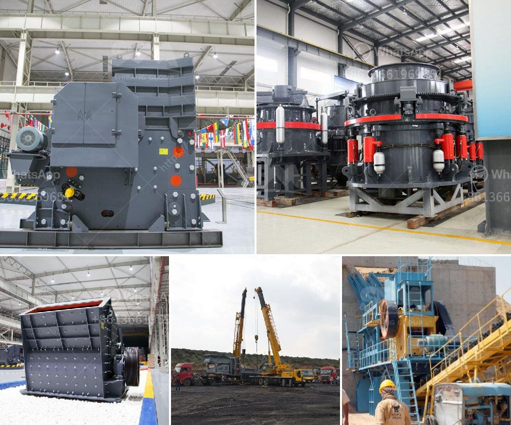

<h3>rock crusher supplier</h3>
When looking for a rock crusher supplier, it is essential to ensure that the equipment you choose is capable of crushing the specific type of rock you plan to process. As the demand for high-quality crushed rock materials continues to grow, so does the need for reliable rock crusher suppliers. In this article, we will explore the factors to consider when selecting a supplier to ensure successful rock crushing operations.

Firstly, it is crucial to determine the type of rock you want to crush. Different rocks have varying hardness levels, abrasiveness, and size requirements. For instance, if you primarily deal with limestone, a supplier offering equipment specifically designed for limestone crushing would be an ideal choice. By selecting a supplier that specializes in your preferred rock type, you can ensure you will receive the equipment with the necessary features and specifications for optimal rock processing.

Secondly, consider the efficiency and capacity of the equipment offered by the rock crusher supplier. This becomes especially important if you have a large amount of rock to be crushed regularly. The capacity of the crusher should match your production needs to ensure smooth and continuous operation. Additionally, check the energy consumption of the equipment, as a more energy-efficient crusher can help you reduce operational costs in the long run.

Next, think about the durability and reliability of the rock crusher. It should be constructed with rugged materials and designed to withstand heavy-duty use. This is particularly significant if you plan to use the crusher in demanding environmental conditions such as mining or quarrying operations. A reliable rock crusher should feature robust components that can withstand high impact forces and frequent vibration without premature wear or failure.

Another factor to consider is the availability of spare parts and after-sales support. Even with a durable rock crusher, there is always a possibility of component damage or wear and tear that requires replacement. Choosing a supplier that offers readily available spare parts locally or internationally will minimize downtime and keep your operations running smoothly. Additionally, a supplier that provides prompt and effective after-sales support can assist you with any technical issues, assisting you in maximizing the crusher's performance and efficiency.

Lastly, consider the cost-effectiveness of the equipment provided by the supplier. While the initial purchase price is important, it is equally essential to evaluate the long-term costs associated with owning and operating the rock crusher. Assess factors such as maintenance needs, energy consumption, and overall lifespan to determine the true cost of the equipment over its lifetime. By choosing a supplier that offers high-quality equipment at a reasonable price and with reduced operating costs, you can maximize the return on your investment.

In conclusion, selecting the right rock crusher supplier is crucial for effective and efficient rock crushing operations. Ensure that the supplier can provide equipment designed for the specific type of rock you intend to process. Assess the efficiency, capacity, durability, and reliability of the equipment, as well as the availability of spare parts and after-sales support. Lastly, consider the long-term cost-effectiveness of the equipment. By thoroughly evaluating these factors, you can confidently choose a rock crusher supplier that will meet your needs and contribute to the success of your operations.
<h3>Contact us</h3><ul><li><strong>Whatsapp:&nbsp;<a href="https://wa.me/8613661969651">+8613661969651</a></strong></li><li><a href="https://swt.shibang-china.com/?git&amp;zhl&amp;rock crusher supplier"><strong>Online Service(chat now)</strong></a></li></ul><h3>Related</h3><ul><li><a href='cost of small scale cement factory.md'>cost of small scale cement factory</a></li><li><a href='rock crusher supplier.md'>rock crusher supplier</a></li><li><a href='barite crushing machine.md'>barite crushing machine</a></li><li><a href='dicalcium phosphate process hydrochloric acid flow chart.md'>dicalcium phosphate process hydrochloric acid flow chart</a></li><li><a href='aggregate washing plant cost.md'>aggregate washing plant cost</a></li></ul>