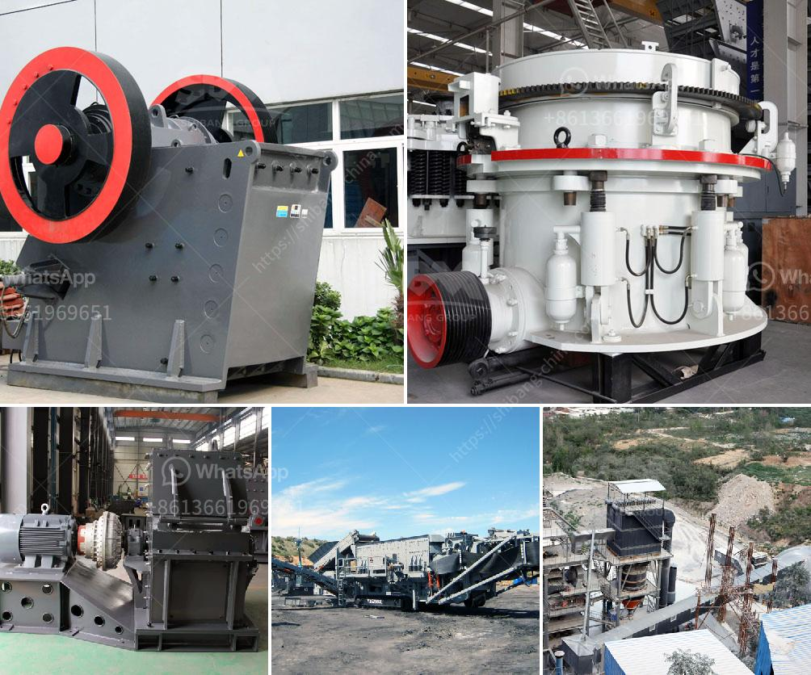

<h3>rock crusher unit</h3>
A rock crusher unit is an important piece of equipment for any construction or mining project. This unit is used to crush large rocks into smaller gravel or rock dust, which can then be used as construction material or for other purposes. Rock crushers are built to withstand even the toughest of conditions, making them highly reliable and efficient.

The primary purpose of a rock crusher unit is to process large rocks into smaller sizes for different applications. This can include producing aggregates for road construction, producing gravel for landscaping or decorative purposes, or preparing rock for subsequent processing in a mining operation. The size of the crushed material can be adjusted to meet specific project requirements, making a rock crusher unit highly versatile.

These units usually consist of a heavy-duty crusher along with a vibrating feeder that ensures a consistent and even flow of materials. The feeder reduces the size of the rocks by diverting them into the crusher's hopper, where they are crushed by powerful jaws or a rotating cone. Once crushed, the material is transported through a conveyor belt system for further processing or storage.

Rock crushers are often equipped with a variety of safety features to protect workers and prevent accidents. Some of these features include emergency stop buttons, safety guards, and warning signs. Additionally, modern rock crusher units are designed to minimize noise and dust emissions, making them more environmentally friendly.

Whether used in construction or mining, a rock crusher unit is an essential tool in any project that involves crushing rocks. Its ability to efficiently process large quantities of material and produce high-quality output makes it an invaluable asset. By choosing the right rock crusher unit, construction or mining companies can ensure the success and efficiency of their projects.
<h3>Contact us</h3><ul><li><strong>Whatsapp:&nbsp;<a href="https://wa.me/8613661969651">+8613661969651</a></strong></li><li><a href="https://swt.shibang-china.com/?git&amp;zhl&amp;rock crusher unit"><strong>Online Service(chat now)</strong></a></li></ul><h3>Related</h3><ul><li><a href='chromite ore processing in zimbabwe.md'>chromite ore processing in zimbabwe</a></li><li><a href='cost of setting a sand crushing plant in india.md'>cost of setting a sand crushing plant in india</a></li><li><a href='differences between hammer mill and ball mill.md'>differences between hammer mill and ball mill</a></li><li><a href='stone crush machine pakistan price.md'>stone crush machine pakistan price</a></li><li><a href='list of equipments use in cement factory.md'>list of equipments use in cement factory</a></li></ul>