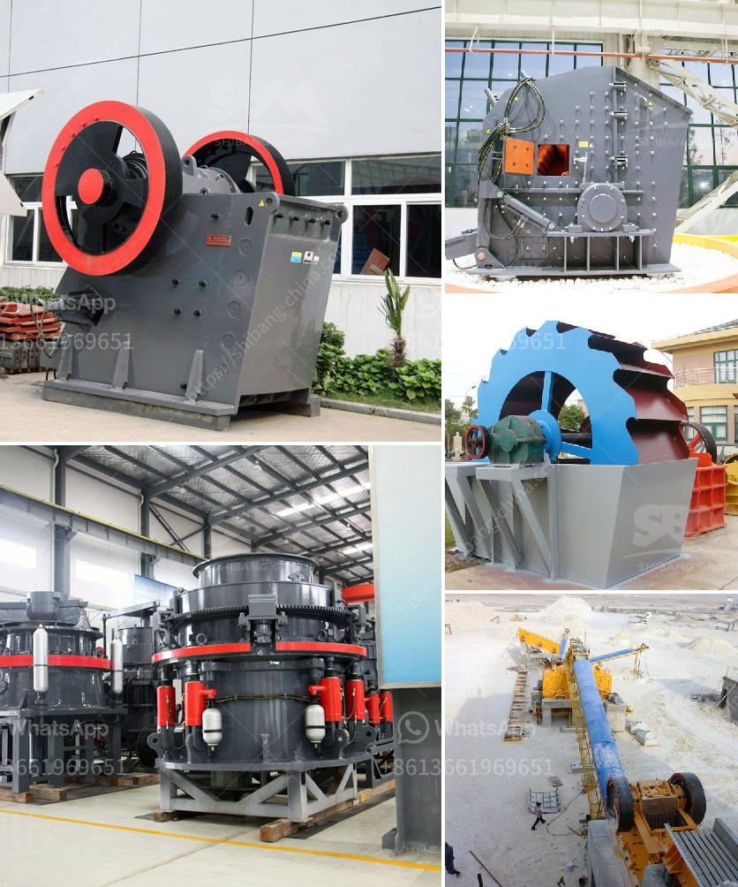

<h3>rock crusher used in mining and quarry for sale</h3>
Rock crushers are used in many industries such as mining, quarrying, construction, and demolition. They are often used in combination with other types of machinery like screens, conveyor systems, and washing equipment to create a complete system that processes rocks of various sizes and shapes. These machines are essential for breaking down large rocks into smaller, more manageable sizes for further processing.

When it comes to mining and quarry operations, rock crushers play a crucial role in the initial crushing stage. With the help of these machines, the raw materials extracted from the earth are efficiently and effectively processed. This results in the production of various essential materials like aggregates, limestone, granite, and gravel, which are used in various construction projects, concrete production, and road building.

The primary function of a rock crusher is to break down large rocks into smaller pieces. These smaller pieces can then be used for more specific purposes, such as creating road base, rip-rap, or stone dust for the production of asphalt and cement. The size and shape of the output material can be easily adjusted, depending on the specific requirements of the project. This versatility ensures that a wide range of materials can be produced, resulting in cost savings and increased productivity.

There are several types of rock crushers commonly used in mining and quarry operations. These include jaw crushers, gyratory crushers, cone crushers, and impact crushers. Each type of crusher has its own unique features and advantages, allowing it to crush different types of rocks and materials. It is important to choose the right rock crusher for the job to ensure maximum productivity and efficiency.

Rock crushers used in mining and quarry operations can vary significantly in size, power, and capacity. Depending on the nature of the material to be crushed and the desired product size, there can be large variations in machines' capabilities. It is essential to consider factors such as the hardness and abrasiveness of the material, the required output size, and the desired production capacity when selecting a rock crusher for a specific application.

When considering the purchase of a rock crusher for mining and quarry operations, there are several important factors to consider. One of these is the overall quality of the machine. It is essential to invest in a reliable and durable rock crusher that can withstand the demanding conditions of the mining and quarry environment. Additionally, the availability of spare parts, maintenance requirements, and the level of technical support provided by the manufacturer should also be considered.

Another important factor is cost-effectiveness. While it is crucial to select a rock crusher that meets the specific needs of the operation, it is also important to choose one that offers good value for money. Comparing prices, considering long-term operating costs, and evaluating the overall return on investment are all critical steps in the purchasing process.

In conclusion, rock crushers are integral machines in the mining and quarrying industry. They are essential for breaking down large rocks into smaller, more manageable sizes for further processing. A well-chosen rock crusher can significantly improve the efficiency and productivity of mining and quarry operations. When purchasing a rock crusher, it is vital to consider factors such as quality, cost-effectiveness, and customer support to ensure the best investment for the specific needs of the operation.
<h3>Contact us</h3><ul><li><strong>Whatsapp:&nbsp;<a href="https://wa.me/8613661969651">+8613661969651</a></strong></li><li><a href="https://swt.shibang-china.com/?git&amp;zhl&amp;rock crusher used in mining and quarry for sale"><strong>Online Service(chat now)</strong></a></li></ul><h3>Related</h3><ul><li><a href='operation hammer mill.md'>operation hammer mill</a></li><li><a href='jaw crushing plant.md'>jaw crushing plant</a></li><li><a href='vibrating screen supplier philippines.md'>vibrating screen supplier philippines</a></li><li><a href='sell european stone crusher.md'>sell european stone crusher</a></li><li><a href='limestone gypsum crusher machine.md'>limestone gypsum crusher machine</a></li></ul>