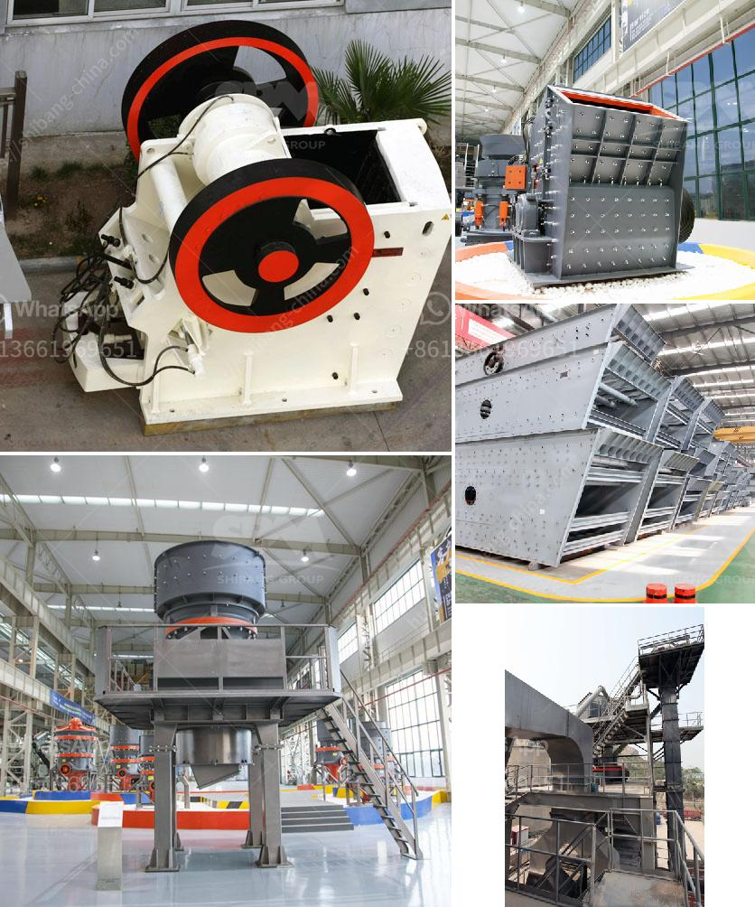

<h3>rock crushers tonne per hour</h3>
Rock crushers are machines used to break down rocks into smaller pieces. They are commonly used in the mining industry for crushing rock mines that have been extracted from the earth for various purposes. These machines are powerful and efficient, capable of turning large rocks into gravel or even dust. One important measure of their efficiency is the number of tonnes of rock they can crush in an hour.

The tonnage capacity of a rock crusher is measured by how many tonnes it can crush in an hour. This measurement is commonly expressed in tonnes per hour (t/h). Different crushers have different capacities, as they have been designed for different applications and purposes. Among the most popular types of rock crushers used in mining operations are jaw crushers, cone crushers, and impact crushers.

Jaw crushers are often used in aggregate production and mining operations due to their ability to crush tough and abrasive materials effectively. They consist of a fixed jaw plate and a movable jaw plate, with the rock being compressed between them. A jaw crusher can typically produce between 1 to 600 tonnes per hour, depending on the feed material and the size of the discharge opening.

Cone crushers, on the other hand, are used in secondary and tertiary crushing applications. They are capable of producing between 100 and 2,500 tonnes per hour, depending on the size of the feed material and the desired product size. Cone crushers work by squeezing the rock between an eccentrically gyrating spindle, which is covered by a wear-resistant mantle, and a concave hopper.

Impact crushers, also known as hammer crushers, are used for primary and secondary crushing of rocks. They operate by throwing the rock into a hard surface, either against a wall or an anvil. These crushers can produce between 50 and 1,200 tonnes per hour, depending on the size of the feed material and the desired product size.

When choosing a rock crusher, it is essential to consider factors such as capacity, efficiency, and durability. These machines are typically subjected to heavy loads and must be able to withstand constant use in harsh conditions. Investing in a high-quality rock crusher can ensure that it will last for many years and provide the necessary results for mining operations.

In conclusion, rock crushers play a crucial role in the mining industry, allowing for the efficient processing of extracted rocks into smaller, manageable sizes. The tonnage capacity of a rock crusher is an essential measure of its effectiveness, with various types of crushers offering different capacities. Whether it is a jaw crusher, cone crusher, or impact crusher, choosing the right rock crusher for a mining operation is vital to its success. By taking into account factors such as capacity, efficiency, and durability, operators can select a rock crusher that will meet their specific needs and deliver the best possible results.
<h3>Contact us</h3><ul><li><strong>Whatsapp:&nbsp;<a href="https://wa.me/8613661969651">+8613661969651</a></strong></li><li><a href="https://swt.shibang-china.com/?git&amp;zhl&amp;rock crushers tonne per hour"><strong>Online Service(chat now)</strong></a></li></ul><h3>Related</h3><ul><li><a href='vertical vertical roller mill.md'>vertical vertical roller mill</a></li><li><a href='cone crusher device.md'>cone crusher device</a></li><li><a href='how to start a robo sand machinery.md'>how to start a robo sand machinery</a></li><li><a href='vibrating screen design products from philippines.md'>vibrating screen design products from philippines</a></li><li><a href='used quarry equipment for sale in calgary canada.md'>used quarry equipment for sale in calgary canada</a></li></ul>