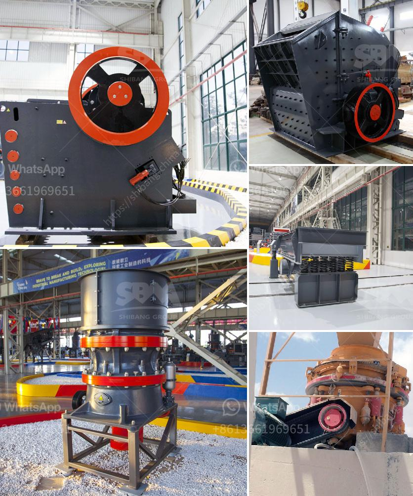

<h3>rock crushing and ballast</h3>
Rock crushing plays a crucial role in construction and road-building projects. It helps create solid foundations for buildings, roads, railroads, and other infrastructure. One of the key products derived from this activity is ballast, which plays a significant role in ensuring the stability and longevity of these structures. In this article, we will explore the importance of rock crushing and ballast in infrastructure development.

Rock crushing is the process of breaking down large rocks into smaller, more manageable pieces. This process is typically carried out using heavy machinery such as jaw crushers, impact crushers, and cone crushers. These machines are designed to handle the toughest materials and are commonly used in quarries and mining operations.

The crushed rocks produced through this process are essential for various construction applications. However, one particularly important application is the production of ballast. Ballast refers to a layer of crushed stones that is laid down to support and stabilize tracks for trains, trams, and railways. It prevents the tracks from shifting, ensures proper drainage, and helps distribute the load evenly.

Without ballast, rail tracks would be prone to movement, resulting in poor ride quality, increased maintenance, and safety hazards. The stability and durability of ballast are critical for the smooth operation of trains and the overall efficiency of transportation systems. Furthermore, ballast also acts as a sound barrier, reducing noise pollution from passing trains and improving the overall environment for nearby communities.

In addition to its crucial role in railway infrastructure, ballast is also used in other construction projects. It can serve as a foundation for buildings, roads, and underground structures, providing stability and preventing settling. Ballast is known for its excellent drainage properties, which makes it ideal for areas where water accumulation is a concern.

In conclusion, rock crushing and the production of ballast are essential components of infrastructure development. They contribute to the creation of solid foundations, stability, and longevity of structures such as railways, highways, and buildings. From ensuring the smooth operation of trains to providing stability for roads and structures, rock crushing and ballast help us build safe and durable infrastructure.
<h3>Contact us</h3><ul><li><strong>Whatsapp:&nbsp;<a href="https://wa.me/8613661969651">+8613661969651</a></strong></li><li><a href="https://swt.shibang-china.com/?git&amp;zhl&amp;rock crushing and ballast"><strong>Online Service(chat now)</strong></a></li></ul><h3>Related</h3><ul><li><a href='vertical mills retention time formula.md'>vertical mills retention time formula</a></li><li><a href='pulverizer crusher machine manufacturers south africa.md'>pulverizer crusher machine manufacturers south africa</a></li><li><a href='chrome mining methods in zimbabwe.md'>chrome mining methods in zimbabwe</a></li><li><a href='stone crushing plant 100tph for sale.md'>stone crushing plant 100tph for sale</a></li><li><a href='sand making machine manufacturer.md'>sand making machine manufacturer</a></li></ul>