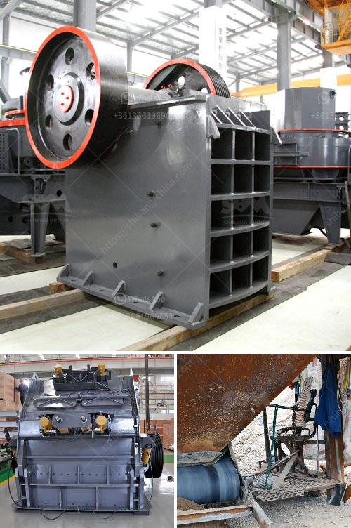

<h3>rock crushing companies</h3>
Rock crushing companies play a crucial role in the construction and mining industries. Whether it is gravel, limestone, or various other materials, these companies utilize heavy machinery to break down large rocks into smaller, more manageable sizes for use in various projects.

One of the primary benefits of utilizing rock crushing companies is their ability to provide a cost-effective solution for large-scale projects. Instead of purchasing expensive equipment and maintaining a team for rock crushing, contractors can rely on these specialized companies to bring in the necessary machinery and expertise. This not only saves time and money, but it also allows contractors to focus on other aspects of their projects.

Furthermore, rock crushing companies often have access to a wide range of equipment suitable for different types of rock and desired end products. By utilizing the right machinery, these companies can efficiently produce aggregates of varying sizes to meet the specific needs of their clients. This flexibility is particularly advantageous, as it ensures that the materials produced are suitable for a variety of construction purposes.

Another key advantage of working with rock crushing companies is the emphasis they place on environmental sustainability. Many reputable companies prioritize environmentally-friendly practices by implementing dust control measures, noise reduction mechanisms, and ensuring proper waste management. By adhering to these regulations, they not only safeguard the environment but also improve the overall reputation of the construction industry.

In conclusion, rock crushing companies are essential players in the construction and mining sectors. Their ability to efficiently break down large rocks into smaller sizes, provide cost-effective solutions, and prioritize environmental concerns make them valuable partners for any construction project. By outsourcing rock crushing tasks, contractors can save time, money, and resources while still ensuring the supply of high-quality materials needed for successful project completion.
<h3>Contact us</h3><ul><li><strong>Whatsapp:&nbsp;<a href="https://wa.me/8613661969651">+8613661969651</a></strong></li><li><a href="https://swt.shibang-china.com/?git&amp;zhl&amp;rock crushing companies"><strong>Online Service(chat now)</strong></a></li></ul><h3>Related</h3><ul><li><a href='mobile crusher discount.md'>mobile crusher discount</a></li><li><a href='company profile for suppliers of mining equipment.md'>company profile for suppliers of mining equipment</a></li><li><a href='quartz powder making machinery.md'>quartz powder making machinery</a></li><li><a href='standard operating procedure for coal pulverizer.md'>standard operating procedure for coal pulverizer</a></li><li><a href='ball mill mexico.md'>ball mill mexico</a></li></ul>