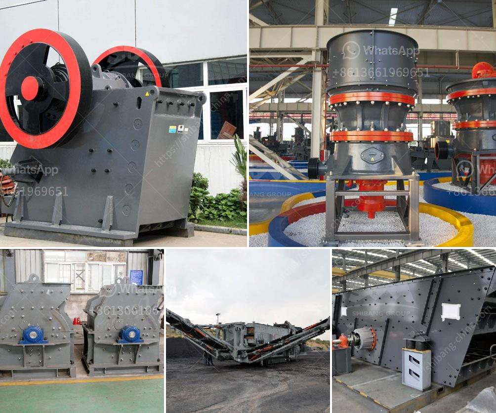

<h3>rock crushing machine nigeria</h3>
Nigeria is a country endowed with vast mineral resources, including solid minerals such as limestone, granite, and basalt. The mining sector in Nigeria has experienced tremendous growth over the years, with the discovery of various minerals and ores. However, the mining sector is still largely underdeveloped and requires substantial investment to unlock its full potential.

The extraction of these minerals requires the use of rock crushing machines. These machines are used to break large rocks into smaller particles, making it easier to extract valuable minerals. Nigeria has a varied range of rock crushing machines, such as jaw crushers, cone crushers, impact crushers, and mobile crushers.

Jaw Crusher: A jaw crusher is commonly used as the primary crushing machine in the crushing process. It is widely used in a variety of stone production lines and ore crushing production lines. It is commonly used in the crushing of basalt, granite, limestone, quartzite, and other hard materials.

Cone Crusher: A cone crusher is a secondary crushing machine that is used to crush mid-hard and above mid-hard ores and rocks, such as iron ore, copper ore, limestone, quartz, granite, and sandstone. It is widely used in mining, metallurgy, building materials, road construction, chemical industry, and other industries.

Impact Crusher: An impact crusher is a machine that uses striking as opposed to pressure to reduce the size of a material. It is widely used in a variety of ore crushing, railway, highway, energy, cement, chemical, construction, and other industries. The impact crusher is capable of crushing a variety of coarse, medium, and fine materials, such as granite, limestone, concrete, and more.

Mobile Crusher: A mobile crusher is a highly flexible machine that can be configured to suit different crushing applications. It is commonly used in the mining, metallurgy, building materials, transportation, and water conservancy industries. Mobile crushers are compact and convenient, making them ideal for on-site crushing operations.

The use of rock crushing machines in Nigeria has greatly improved the efficiency and productivity of the mining industry. The machines have made it easier and faster to extract valuable minerals from the earth, contributing to Nigeria's economic growth. Additionally, the rock crushing machines have created job opportunities for many Nigerians, both in the manufacturing and mining sectors.

However, challenges still exist in the rock crushing machine sector in Nigeria. Limited access to financing, lack of skilled labor, and inadequate infrastructure are some of the factors hindering the growth of the sector. Furthermore, there is a need for increased investment in research and development to enhance the performance and efficiency of rock crushing machines in Nigeria.

In conclusion, rock crushing machines play a crucial role in Nigeria's mining sector. They are essential tools for extracting valuable minerals from the earth and driving economic growth. The government and private sector stakeholders should work together to address the challenges facing the sector and promote investment in the manufacturing and mining industries. With the right support, Nigeria can harness its vast mineral resources and become a major player in the global mining industry.
<h3>Contact us</h3><ul><li><strong>Whatsapp:&nbsp;<a href="https://wa.me/8613661969651">+8613661969651</a></strong></li><li><a href="https://swt.shibang-china.com/?git&amp;zhl&amp;rock crushing machine nigeria"><strong>Online Service(chat now)</strong></a></li></ul><h3>Related</h3><ul><li><a href='mill crusher pigment manufacturer in kenya.md'>mill crusher pigment manufacturer in kenya</a></li><li><a href='how much is gold hammer mill crusher.md'>how much is gold hammer mill crusher</a></li><li><a href='vertical roller mill in cement plant.md'>vertical roller mill in cement plant</a></li><li><a href='marble powder plant.md'>marble powder plant</a></li><li><a href='jaw crusher vibration analysis pdf.md'>jaw crusher vibration analysis pdf</a></li></ul>