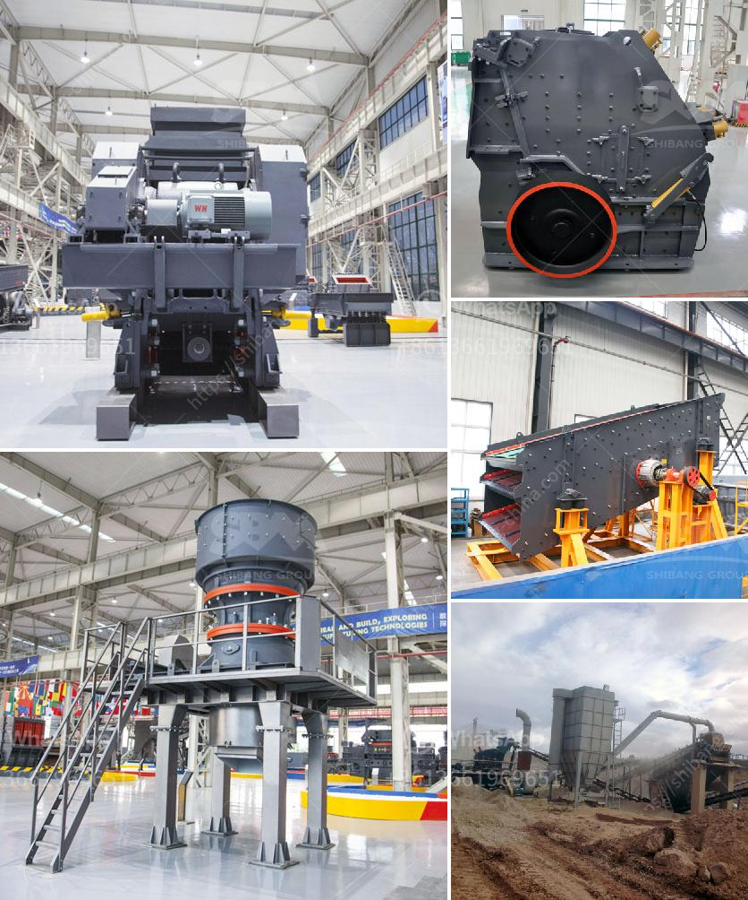

<h3>rock crushing plants in tanzania</h3>
Tanzania, a country located in East Africa, boasts vast reserves of natural resources such as minerals, forests, and wildlife. One particular resource that has gained significant attention in recent years is rocks. Rocks of various types are found abundantly across the country, and their potential for economic value has not gone unnoticed. This has led to the establishment of rock crushing plants in Tanzania, where large rocks are broken down into smaller pieces to be used for various purposes.

Rock crushing plants in Tanzania play a vital role in improving the lives of local communities by providing a sustainable source of construction materials. These plants transform large rocks into different sizes of aggregates, which are crucial components in the construction industry. The aggregates are used in the production of concrete, asphalt, and road base materials, among others.

One of the key advantages of rock crushing plants is their ability to process different types of rocks. Whether it's gravel, limestone, granite, or basalt, these plants can efficiently crush and sort the rocks into desired sizes. This versatility allows for the production of a wide range of construction materials that meet various specifications and requirements.

Furthermore, rock crushing plants significantly contribute to the local economy by creating job opportunities for the community. These plants require a skilled workforce to operate and maintain the machinery involved in the crushing process. From machine operators to maintenance technicians, these jobs help alleviate unemployment and contribute to the overall economic growth of the region.

In addition, rock crushing plants in Tanzania also have a positive environmental impact. Rather than extracting rocks from natural habitats, these plants help minimize the destruction of natural resources. By utilizing rocks previously considered as waste or unusable, the plants promote sustainable resource utilization, reducing the demand for new materials and minimizing the environmental footprint.

Rock crushing plants in Tanzania have proven to be a crucial investment for both the country's development and the preservation of its natural resources. Through their ability to transform rocks into valuable construction materials, these plants provide necessary resources for infrastructure development while supporting the local economy and environmental sustainability. As Tanzania continues to seek economic growth and improvement of living standards, rock crushing plants remain an invaluable asset for the country's progress.
<h3>Contact us</h3><ul><li><strong>Whatsapp:&nbsp;<a href="https://wa.me/8613661969651">+8613661969651</a></strong></li><li><a href="https://swt.shibang-china.com/?git&amp;zhl&amp;rock crushing plants in tanzania"><strong>Online Service(chat now)</strong></a></li></ul><h3>Related</h3><ul><li><a href='machinery required for stone crusher.md'>machinery required for stone crusher</a></li><li><a href='used stone crushing plant for sale in spain.md'>used stone crushing plant for sale in spain</a></li><li><a href='plant equipment list for cost estimation.md'>plant equipment list for cost estimation</a></li><li><a href='tracked mobile screening plant.md'>tracked mobile screening plant</a></li><li><a href='pe 200 x 300 stone crusher.md'>pe 200 x 300 stone crusher</a></li></ul>