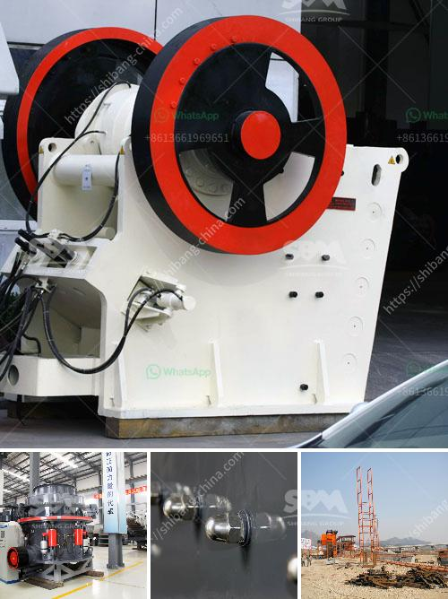

<h3>rock crushing price</h3>
Rock crushing is an important process that utilizes various equipment to break down large stones into smaller rock fragments. This process is commonly used in construction, mining, and other industries where the raw material needs to be crushed for further processing. When considering rock crushing, one of the key factors to consider is the price of the equipment and the services involved.

The price of rock crushing can vary widely depending on several factors. Here are some of the key factors that influence the cost:

1. Type of Equipment: The price of rock crushing equipment can vary based on the type of machinery used. There are various types of crushers available in the market, including jaw crushers, cone crushers, impact crushers, and others. Each of these machines has different features and capabilities, which can affect the overall price.

2. Capacity: The capacity of the rock crushing equipment plays a significant role in determining its price. Higher capacity machines tend to be more expensive as they are capable of processing larger quantities of rock per hour. The required capacity will depend on the production needs of the specific project.

3. Size and Hardness of Rocks: The size and hardness of the rocks to be crushed also impact the price. Harder rocks require more powerful equipment, which can increase the overall cost. Additionally, larger rocks may require specialized crushers or additional equipment, which can also add to the price.

4. Labor and Operational Costs: Apart from the equipment cost, labor and operational costs also contribute to the overall price of rock crushing. Skilled operators and technicians are crucial for safely operating the machinery and ensuring efficient production. Their salaries or wages, along with other associated costs, should be factored into the overall price.

5. Maintenance and Repairs: Like any other mechanical equipment, rock crushing machinery requires regular maintenance and occasional repairs. The price of rock crushing should include consideration of these costs, including spare parts, servicing, and repairs, as they can significantly impact the overall cost of the operation.

6. Location and Accessibility: The location and accessibility of the rock crushing site can also influence the price. Transporting heavy machinery to remote locations or areas with difficult terrains can increase the expenses. It is essential to assess the transportation logistics and accessibility before finalizing the price.

7. Additional Services: Some companies offer additional services such as on-site crushing, material hauling, or waste disposal. These value-added services may increase the overall price but can provide convenience and time-saving benefits for the customer.

In conclusion, the price of rock crushing depends on several crucial factors, such as the type and capacity of equipment, size and hardness of rocks, labor and operational costs, maintenance and repair expenses, location, and any additional services required. It is important to consider these factors to ensure that the price aligns with the specific project's needs and budget. Consulting with reliable equipment suppliers or service providers can help in making an informed decision and achieving cost-effective rock crushing operations.
<h3>Contact us</h3><ul><li><strong>Whatsapp:&nbsp;<a href="https://wa.me/8613661969651">+8613661969651</a></strong></li><li><a href="https://swt.shibang-china.com/?git&amp;zhl&amp;rock crushing price"><strong>Online Service(chat now)</strong></a></li></ul><h3>Related</h3><ul><li><a href='rock crushing companies.md'>rock crushing companies</a></li><li><a href='ball mill construction.md'>ball mill construction</a></li><li><a href='conveyor chain suppliers south africa.md'>conveyor chain suppliers south africa</a></li><li><a href='impact crusher suppliers italy.md'>impact crusher suppliers italy</a></li><li><a href='standard operating procedure for coal pulverizer.md'>standard operating procedure for coal pulverizer</a></li></ul>