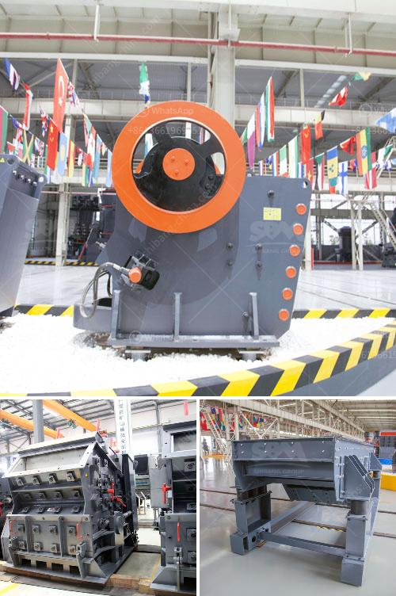

<h3>rock quarry equipment for sale in europe</h3>
Rock quarrying is one of the oldest industries in human civilization. It has been an integral part of our life for centuries by providing valuable resources to construction and infrastructure projects around the world. Europe, being one of the oldest inhabited continents, has a rich history of quarrying and stone extraction. To support this thriving industry, a wide variety of rock quarry equipment is available for sale in Europe, ensuring efficient and effective operations.

The process of extracting and processing rocks from quarries requires specialized machinery and equipment. These machines are designed to handle heavy loads, work in challenging environments, and increase productivity. Rock quarry equipment encompasses a wide range of machinery such as crushers, classifiers, drills, excavators, haul trucks, loaders, and more. Each of these equipment plays a crucial role in the quarrying process and ensures that operations run smoothly.

Europe, being home to some of the world's largest and oldest quarries, offers a diverse selection of rock quarry equipment for sale. As the demand for stones and aggregates continues to rise, quarries in Europe require efficient equipment to produce and deliver materials in a timely manner. This demand has led to the development and innovation of cutting-edge machinery specifically designed for the European quarrying industry.

Crushers are among the primary machinery used in rock quarries. These powerful machines reduce large rocks into smaller, manageable sizes. Jaw crushers, impact crushers, and cone crushers are commonly used in quarrying operations. They efficiently break down rocks and allow for further processing, such as grading and sorting.

Classifiers are another essential piece of equipment used by European quarries. These machines separate materials based on their size and density. By classifying the extracted rocks, quarries can produce consistent and high-quality aggregates for use in various construction projects. Classifiers can be stationary or mobile, providing flexibility and adaptability to meet the demands of different quarrying operations.

Drills are crucial for rock extraction in quarries. They bore holes into the rock face, enabling the use of explosives for controlled blasting. Quarry drilling requires precision and efficiency to minimize waste and maximize production. Various types of drills, such as rotary drills and down-the-hole drills, are available for sale in Europe to cater to different quarrying needs.

In addition to drills, excavators play a fundamental role in rock quarrying. These machines are used for digging, lifting, and loading extracted rocks onto haul trucks. Excavators come in various sizes, with different attachments available for specific tasks. Additionally, wheel loaders are used to transport materials within quarries, providing a versatile and efficient solution for moving aggregates and other heavy materials.

Europe offers a wide range of rock quarry equipment for sale from reputable manufacturers and suppliers. These machines are built to withstand the rigorous demands of quarrying operations and to enhance productivity. While the initial investment in quarry equipment may be substantial, the long-term benefits and cost savings are undeniable.

As the demand for stones for construction projects continues to grow, the importance of properly functioning and efficient quarry equipment cannot be overstated. The availability of rock quarry equipment for sale in Europe ensures that these operations can continue to thrive and provide essential resources for various industries. By investing in modern and reliable machinery, European quarries can efficiently meet the demands of the market while reducing environmental impact, increasing safety standards, and improving profitability.
<h3>Contact us</h3><ul><li><strong>Whatsapp:&nbsp;<a href="https://wa.me/8613661969651">+8613661969651</a></strong></li><li><a href="https://swt.shibang-china.com/?git&amp;zhl&amp;rock quarry equipment for sale in europe"><strong>Online Service(chat now)</strong></a></li></ul><h3>Related</h3><ul><li><a href='price of grinding machine for europe.md'>price of grinding machine for europe</a></li><li><a href='gypsum fertilizer granulator for sale.md'>gypsum fertilizer granulator for sale</a></li><li><a href='ballast crushing equipment.md'>ballast crushing equipment</a></li><li><a href='static jaw crusher.md'>static jaw crusher</a></li><li><a href='mining process of marble crusher.md'>mining process of marble crusher</a></li></ul>