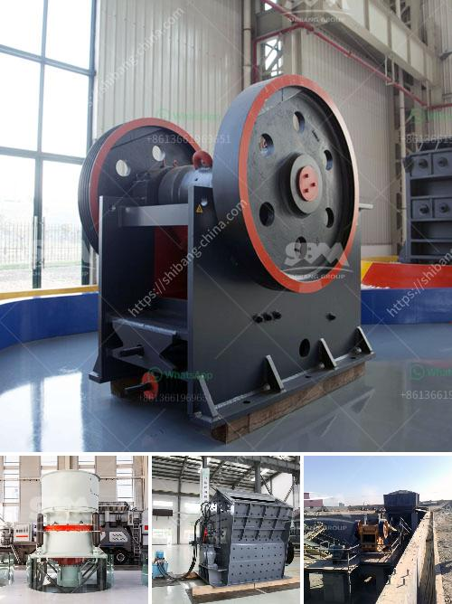

<h3>rock salt mining open pit feasibility study</h3>
Rock salt mining has been a significant industry for many decades, providing essential minerals that are used in various industries worldwide. One option to extract rock salt is through an open pit mining method. This method involves the excavation of rock salt from the surface, allowing for cost-effective and efficient extraction.

Before beginning the mining process, a thorough feasibility study is conducted to determine if open pit mining is viable in a specific location. This study assesses various factors such as geology, market demand, economic viability, and environmental impacts.

Geological surveys play a crucial role in identifying the presence and quality of rock salt deposits. These surveys analyze the depth, thickness, and accessibility of the deposit. By understanding the geological aspects, engineers can estimate the volume of rock salt available for extraction and determine the size and design of the open pit.

Market demand is another critical factor in evaluating the feasibility of open pit mining. A thorough analysis of the regional and international market trends and demand for rock salt is conducted to ensure there is a sustained demand for the extracted mineral. This information helps mining companies make an informed decision about investing in an open pit mine.

Economic viability is a central aspect of any feasibility study. It involves estimating the costs associated with mining operations, including equipment, labor, maintenance, and transportation. By comparing the estimated costs to projected profits, mining companies can determine the financial feasibility of open pit mining.

Environmental impacts are also thoroughly assessed. Mining operations can have adverse effects on the surrounding ecosystem, including water pollution and habitat destruction. The feasibility study analyzes potential mitigation measures to minimize environmental impacts and ensure compliance with environmental regulations.

In conclusion, a comprehensive feasibility study is crucial to determine the viability of open pit rock salt mining. By considering factors such as geology, market demand, economic viability, and environmental impacts, mining companies can make informed decisions about investing in open pit mining operations. With proper planning and implementation, rock salt mining can contribute to various industries while minimizing its environmental footprint.
<h3>Contact us</h3><ul><li><strong>Whatsapp:&nbsp;<a href="https://wa.me/8613661969651">+8613661969651</a></strong></li><li><a href="https://swt.shibang-china.com/?git&amp;zhl&amp;rock salt mining open pit feasibility study"><strong>Online Service(chat now)</strong></a></li></ul><h3>Related</h3><ul><li><a href='dolomite beater mill crusher.md'>dolomite beater mill crusher</a></li><li><a href='fly ash grinding machine manufacturer.md'>fly ash grinding machine manufacturer</a></li><li><a href='crusher for cobble.md'>crusher for cobble</a></li><li><a href='manufacturer of clinker grinding machine.md'>manufacturer of clinker grinding machine</a></li><li><a href='2nd hand crushers thailand.md'>2nd hand crushers thailand</a></li></ul>