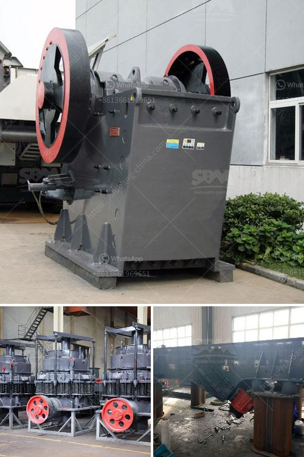

<h3>roll crushers for rent</h3>
Roll crushers are designed to crush friable materials such as coal, limestone, clay, mineral, and earth for the mining, recycling, and power industries. These crushers are available in various sizes and capacities and are highly efficient in crushing materials. They are an essential piece of equipment in many industries and can be conveniently rented for short or long-term use.

Renting roll crushers offers a cost-effective solution for businesses that require the use of this equipment only occasionally or for a specific project. Instead of investing a large sum of money in purchasing a crusher, renting allows businesses to save on upfront capital expenditure. It also eliminates the need for maintenance, repair, and storage costs as these responsibilities are typically borne by the rental company.

Roll crushers for rent are readily available from various rental companies, making it easy to find the right equipment to suit specific needs. Renting also ensures access to the latest models and technologies without the need for frequent equipment upgrades.

These crushers offer several advantages over other types of crushers. They have a simple design, making them easy to use and maintain. Roll crushers have adjustable clearance between the rolls, which can be adjusted to produce the desired product size. This flexibility allows for the production of a variety of sizes and shapes of crushed materials.

Additionally, roll crushers are known for their high reduction ratios, which means they can efficiently reduce the size of the feed material. This results in fewer secondary crushing stages, saving time and energy.

Whether it is for a construction project, mining operation, or recycling facility, renting roll crushers can provide businesses with a cost-effective and convenient solution. With various rental options available, companies can find the right equipment to meet their specific needs and budget. Moreover, the versatility and efficiency of roll crushers make them a reliable choice for businesses in various industries.
<h3>Contact us</h3><ul><li><strong>Whatsapp:&nbsp;<a href="https://wa.me/8613661969651">+8613661969651</a></strong></li><li><a href="https://swt.shibang-china.com/?git&amp;zhl&amp;roll crushers for rent"><strong>Online Service(chat now)</strong></a></li></ul><h3>Related</h3><ul><li><a href='roller crusher for sale gumtree.md'>roller crusher for sale gumtree</a></li><li><a href='small concrete crusher used.md'>small concrete crusher used</a></li><li><a href='aggregates crusher plant for sale in south africa.md'>aggregates crusher plant for sale in south africa</a></li><li><a href='ball mills sizes.md'>ball mills sizes</a></li><li><a href='limestone crushing machines.md'>limestone crushing machines</a></li></ul>