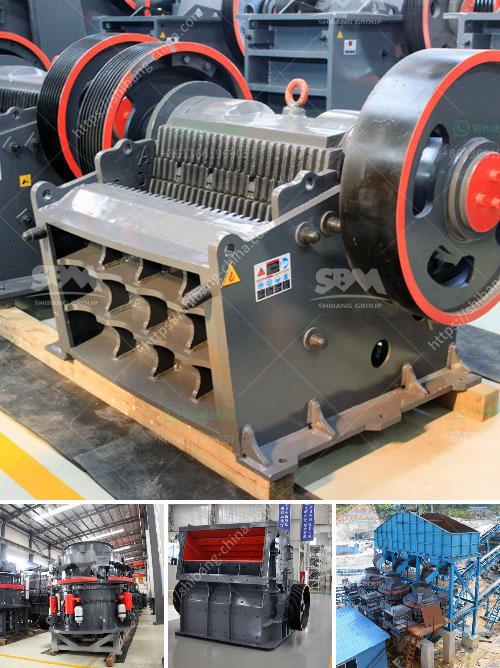

<h3>roller conveyor belts</h3>
In today's fast-paced manufacturing and logistics industries, having an efficient and reliable material handling system is crucial for time and cost-saving operations. One such solution that has gained popularity is the roller conveyor belt. This ingenious invention has revolutionized the way goods are transported within warehouses, distribution centers, and even airports.

Roller conveyor belts consist of a series of cylindrical rollers mounted on a frame, allowing for easy movement of various items from one point to another. They are commonly used in applications where goods need to be moved along a fixed path, saving valuable time and effort for workers.

One of the primary advantages of roller conveyor belts is their versatility. They are suitable for a wide range of products, including boxes, cartons, pallets, and even heavy machinery components. Roller belts can handle both lightweight and heavy loads with ease, thanks to their robust design and durable construction.

Efficiency is of paramount importance in any material handling system, and roller conveyor belts deliver on this aspect. They effectively speed up the transport process, significantly reducing manual labor requirements. By automating the movement of goods, roller belts enhance productivity, allowing workers to focus on more critical tasks.

Moreover, roller conveyor belts ensure consistent and smooth movement of items. The cylindrical rollers distribute the weight evenly, preventing any tipping or tilting of the load. This minimizes the risk of damage and ensures the safe delivery of goods from one end of the conveyor to the other.

Another noteworthy benefit of roller conveyor belts is their space-saving design. Unlike traditional conveyor systems that rely on belts or chains to move products, roller belts take up less floor space. Their compact design allows for more streamlined layouts, maximizing available square footage within warehouses or distribution centers.

Maintenance also plays a vital role in the longevity and efficiency of any equipment. Roller conveyor belts are known for their low maintenance requirements. The simple design and reliable components minimize the need for frequent repairs or replacements. This translates into reduced downtime and enhanced operational efficiency.

In recent years, advancements in roller conveyor belt technology have led to the development of powered roller conveyor systems. These systems incorporate motors that power the movement of the belts, further enhancing productivity and reducing manual labor. With the ability to control speed and direction, powered roller conveyors provide even greater operational flexibility.

When it comes to sustainability, roller conveyor belts also have their advantages. Their energy-efficient design consumes less power compared to other conveyor systems. Additionally, their longevity and low maintenance requirements contribute to reduced waste and long-term cost savings.

In conclusion, roller conveyor belts have become an indispensable component of modern material handling systems. Their versatility, efficiency, and reliability make them ideal for streamlining operations in various industries. Whether it's moving lightweight items or heavy loads, roller belts offer a cost-effective solution that improves productivity and reduces the chances of damage or accidents. As technology continues to advance, these conveyor belts will undoubtedly evolve, presenting exciting opportunities for businesses to further optimize their material handling processes.
<h3>Contact us</h3><ul><li><strong>Whatsapp:&nbsp;<a href="https://wa.me/8613661969651">+8613661969651</a></strong></li><li><a href="https://swt.shibang-china.com/?git&amp;zhl&amp;roller conveyor belts"><strong>Online Service(chat now)</strong></a></li></ul><h3>Related</h3><ul><li><a href='coal grinding mill.md'>coal grinding mill</a></li><li><a href='buy fully gold mining wash plant.md'>buy fully gold mining wash plant</a></li><li><a href='stone mill hammer mill.md'>stone mill hammer mill</a></li><li><a href='china quarry crusher equipment.md'>china quarry crusher equipment</a></li><li><a href='canyon hammer mills.md'>canyon hammer mills</a></li></ul>